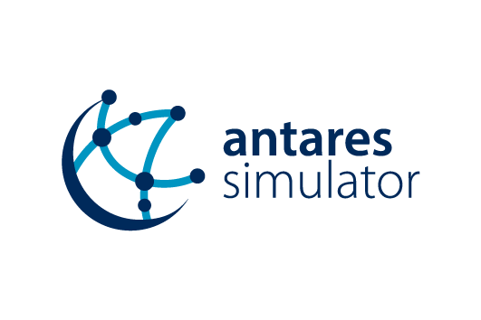
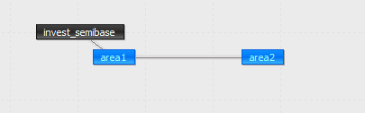

# Antares-Xpansion

[![Status][ubuntu_system_svg]][ubuntu_system_link]  [![Status][windows_vcpkg_svg]][windows_vcpkg_link] [![Status][centos_system_svg]][centos_system_link]  


[](https://opensource.org/licenses/Apache-2.0)

[ubuntu_system_svg]: https://github.com/AntaresSimulatorTeam/antares-xpansion/workflows/Ubuntu%20CI%20(system%20libs)/badge.svg

[ubuntu_system_link]: https://github.com/AntaresSimulatorTeam/antares-xpansion/actions?query=workflow%3A"Ubuntu%20CI%20(system%20libs)"

[windows_vcpkg_svg]: https://github.com/AntaresSimulatorTeam/antares-xpansion/workflows/Windows%20CI%20(VCPKG)/badge.svg

[windows_vcpkg_link]: https://github.com/AntaresSimulatorTeam/antares-xpansion/actions?query=workflow%3A"Windows%20CI%20(VCPKG)"

[centos_system_svg]: https://github.com/AntaresSimulatorTeam/antares-xpansion/workflows/Centos7%20CI%20(system%20libs)/badge.svg

[centos_system_link]: https://github.com/AntaresSimulatorTeam/antares-xpansion/actions?query=workflow%3A"Centos7%20CI%20(system%20libs)"
 
This package works along with RTE's adequacy software ANTARES : https://antares.rte-france.com/

`Antares-Xpansion` is the package which optimizes the installed capacities of an ANTARES study. 
Typical uses of the package are for:

 - **long-term scenario building**: build an economically consistent long-term generation mix

 - **transmission expansion planning** : compute the network development which maximizes social welfare

The investment decisions are optimized by running ANTARES' simulations
iteratively. At each iteration, the installed capacity of the investments are
updated, and the simulations are repeated until the total costs have converged to
a minimum. The total cost evaluated in this problem are the sum of the
**expected operation cost during one year** and the **investment annuity**.

`Antares-Xpansion` is currently under development. Feel free to submit any issue.

## Installation

This software suite has been tested under:

*   Ubuntu 20.04 [![Status][ubuntu_system_svg]][ubuntu_system_link] 
*   Microsoft Windows with Visual Studio 2019 (64-bit) [![Status][windows_vcpkg_svg]][windows_vcpkg_link]
*   Centos 7 [![Status][centos_system_svg]][centos_system_link] 

Antares XPansion is built using CMake.
For installation instructions, please visit [INSTALL.md](INSTALL.md)

## Source Code Content

* [INSTALL](INSTALL.md)           - Installation and building instructions.
* [README](README.md)             - This file.
* [cmake/](cmake)        - files for initializing a solution ready for compilation. 
* [conception/](conception)        - json output description 
* [data_test/](data_test)	 - Free sample data sets. 
* [documentation/](documentation)	 - Documentation generation with doxygen
* [src/cpp/](src/cpp)      - source code for cpp application (lpnamer, benders with mpi, benders without MPI, merge)
* [src/python/](src/python)       - python script for Antares XPansion launch.

## Definition of investment candidates

### Concept

The user of the package defines investment candidates. Each investment candidate
is characterized with the following properties:

 - **name**: name of the investment candidate (warnings : must not contains spaces)
 - **link**: link whose capacity will be invested
 - **annual cost per MW**: investment cost, per year and per MW
 - **unit size**: size, in MW, of an investment unit (e.g. one group of 300 MW)
 - **maximum units**: maximum number of units which can be built
 - **has link profile**: True if candidate has a capacity profile

Concretely, the investment decision will affect only the capacity of the ANTARES'
links. Investing in interconnections can be made directly with the package, while
investing in generation capacity or storage capacity can be made using the
so-called concept of "virtual nodes" with ANTARES.

The definition of all the investment candidates is given in a new input file,
located in the user folder of the study: ./user/expansion/candidates.ini. The
syntax used within this file is illustrated in the example below.

### Example

An example with two investments candidates, one in semi-base generation and one
in network capacity, is given below.



The invested semi-base generation in area 1 is shifted in the "virtual node"
invest_semibase. Within the optimization process, the capacity of the link
between area 1 and invest_semibase will be updated with the new invested capacity.
The `candidates.ini` file for this example will be the following one. This file has to be saved in the folder `user/expansion/`

```
[1]
name = semibase
link = area1 - invest_semibase
annual-cost-per-mw = 126000
unit-size = 200
max-units = 5
has-link-profile = False
already_installed_capacity = 200

[2]
name = grid
link = area1 - area2
annual-cost-per-mw = 3000
unit-size = 500
max-units = 4
has-link-profile = False
```

### Distributed generation

For the case of distributed generation and storage, the investment variables can be continuous, without steps of several MW. In that case, the properties unit-size and max-units can be replaced by the property max-investment, and the invested capacity will be able to take any real value between 0 and max-investment (in MW).

### Capacity profile

By default, the investment candidates offer a "perfect capacity". That is to say, when 1 MW is invested, this 1 MW will be fully available for all the hours of the year. However, by adding the property `link-profile`, one can define a time series (with an hourly time step) of the ratio between the invested capacity and the capacity which is actually available at a given hour. This feature can be used to model investments in (e.g.) intermittent generation or thermal generation with seasonalized maintenance shutdowns.

The property `link-profile` can be used as below:

```
[1]
name = solar_power
link = area1 - pv1
annual-cost-per-mw = 100000
max-investment = 10000
has-link-profile = True
link-profile = pv1.txt
```

Where `pv1.txt` is a text file, located in the `user/expansion/capa/` folder of the study, and which contains the load factor time series of the candidate (one column of 8760 values between 0 and 1, or two columns if there is a direct and indirect profile on the link). When x MW of the candidate solar_power will be invested, the actual time series of available power will be equal to the product of `x` and the time series `pv1.txt`.

## Method and settings

### Benders decomposition

The method used to perform the optimal expansion is a benders decomposition in which:

- The slave problem is an ANTARES simulation, where the installed capacities of the investment candidates are fixed,
- The master problem is a MILP, in which the decision variables are the installed capacities of each investment candidate.

The objective function which is minimized, is the sum of the expected annual operation cost (column OV. COST + column HURDLE COST of the outputs of ANTARES) and the investment annuity (as defined in the `candidates.ini` file).

Concretely, the package will run ANTARES iteratively. Depending on the number of candidates, the convergence to the optimal solution can be quite long (several hundred iterations, and so several hundred ANTARES' simulations). Some algorithmic settings are however available and propose different tradeoffs between the accuracy of the solution and the computation time.

### Settings

The different settings can be modified by the user of the package. All the settings are saved in a file `settings.ini` located in the folder `user/expansion/`.

 - `optimality_gap`: The optimality gap can take any numeric value. The optimality gap is the maximum possible distance (in euros) between the solution returned by the method and the optimal solution.
 - `master`: Can take two values, `relaxed` or `integer`. Defines whether or not should integer variables be used for the master problem.
 - `uc-type`: The UC (Unit Commitment) type can take two different values, `expansion_fast` or `expansion_accurate`. It defines which mode will be used in ANTARES. `expansion_fast` correponds to the fast mode of ANTARES in which the minimum up/down and minimum stable power constraints are relaxed whereas `expansion_accurate` takes into account the technical constraints of the thermal power plants as well as their start-up costs.

An example of a `settings.ini` file with the appropriate syntax is given below.
```
uc_type = expansion_fast
master = integer
optimality_gap = 0
max_iteration = 100
```
Note that the optimality gap can also be given relatively to be best found solution by entering a % after the numeric value of the setting. In that case, the optimality is between 0%and 100% and the decimal separator is a point (.).

#### Which settings should I use for my expansion problem?

##### 1. **If I have to run several expansion optimizations of different variants of a study and compare them**

In that case, if the optimal solutions are not returned by the package, the comparison of several variants can be tricky as the imprecision of the method might be in the same order of magnitude as the changes brought by the input variations.
It is therefore advised to be as closed as possile from the optimum of the expansion problem. To do so, the two following conditions should necessarily be fulfilled:
- set the `optimality_gap` to zero.
[Remark : even with the conditions mentionned above, the reslult might be slighty different from the optimum due to numeric approximations, this can be partly solved by putting to optimality gap to -Inf]

##### 2. **If I'm building one consistent generation/transmission scenario**

As the optimal solution is not more realistic than an approximate solution of the modelled expansion problem. The settings can be less constraining with:
 - an `optimality_gap` of a few million euros

## How to use the package?

First, create an Antares study with the description of the candidates and create the `candidates.ini` and `settings.ini` files as explained above and store them in the directory `study_path/user/expansion`.

Antares Xpansion does not have a GUI, the entry point to run Antares Xpansion is in the executable
`/antares-xpansion-install-dir/xpansion-launcher/antares-xpansion-launcher.exe`.
This binary should be run from a command prompt or unix terminal:

TODO code snippet with the shell command and output 

To run, the script needs to fill the `--step, --dataDir and --installDir` options.

##### step

The python script does several operations one after the other. The step option allows to execute only one step or all the steps (Interaction between the different bricks).

|     name         |     action                                                                 |
|------------------|----------------------------------------------------------------------------|
|     antares      |     Launch antares one time to   get the Antares problem                   |
|     getnames     |     Launch getnamer one time to   get the name of Antares variables        |
|     lp           |     Launch lpnamer one time to   create the master problem of expansion    |
|     optim        |     Launch the resolution of   Antares Xpansion                            |
|     update       |     Update antares study with investment solution                          |
|     full         |     Launch all steps in order   (antares > getnames > lp > optim > update) |

##### dataDir
Indicate the Antares simulation path. The specified path must be an explicit path. 

##### simulationName
This option enables to give a name to an Antares simulation. It is necessary if you only run one of the following steps: getnames, lp, optim without restarting the antares step.

##### installDir
This option, not optional, is used to define the directory containing the different executables that the script can launch. The path specified must be an explicit path. The directory must contain the following executables:
 
##### method
This option enables to set the type of resolution to be used for Antares Xpansion :

- mpibenders : Launch the MPI version of the Benders decomposition if the user has MPI
- mergeMPS : Not implemented. Launch frontal resolution without decomposition
- sequential : Launch Benders decomposition
 

#### Results
The user can find the final solution in *benderssequential.log* file, which is in the Antares study, in the *output/simulation-name/lp directory*.

#### Errors

Xpansion will not work if the initial Antares study is not running. The user must therefore check beforehand that the Antares simulations do not contain any errors.
Sometimes Xpansion needs to be restarted.
