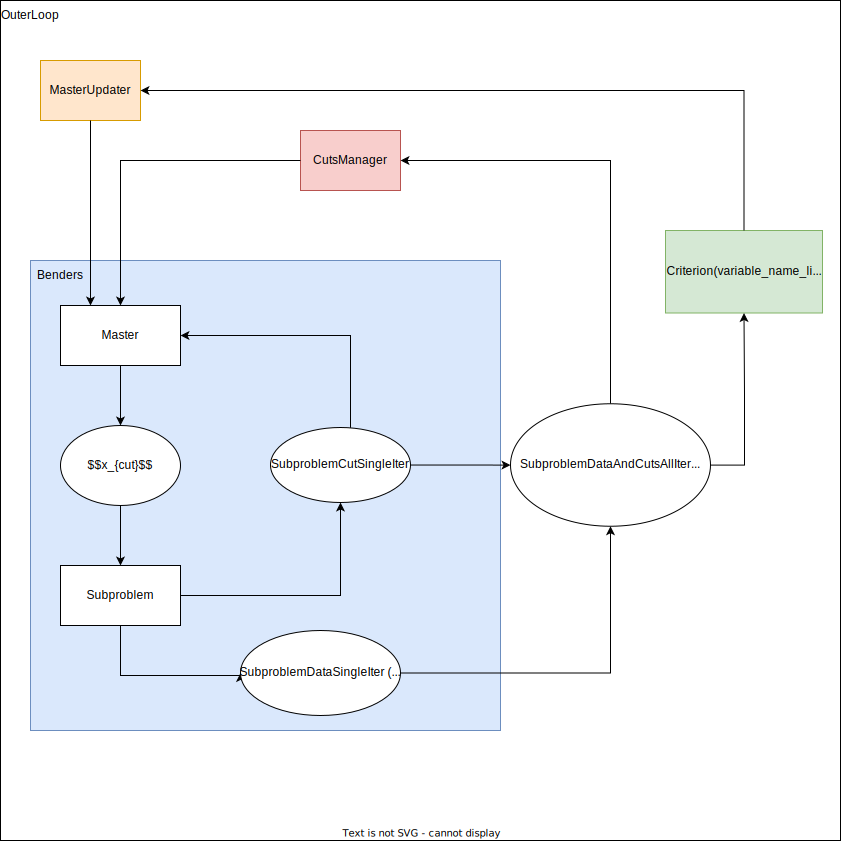
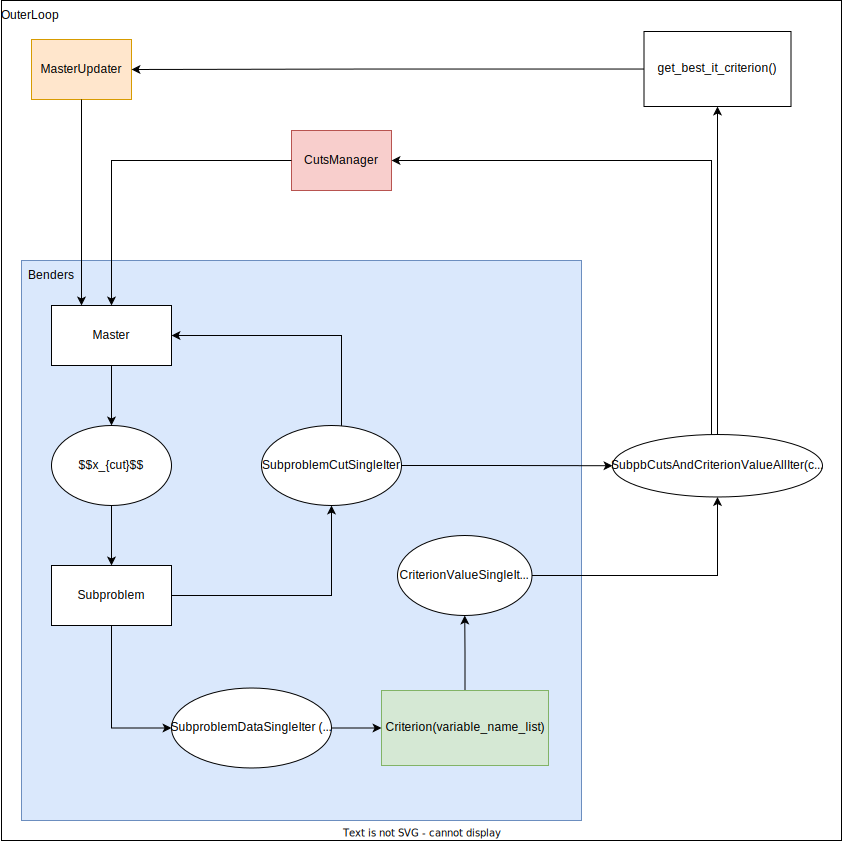

# Storage of subproblem data for Benders outer loop

## Status

Accepted (2024/02/28)

## Context

When introducing the outer loop around Benders algorithm, some subproblem data need to be stored at each iteration, namely :
- Subproblem cuts, that are used later on by the cuts manager for Benders warm start,
- Subproblem solution data, that contain in particular the solution value for each variable of the subproblem. It is used later on the compute the criterion value.

The initial design is the following : 

The source of the drawing can be accessed [here](images/design_outer_loop.drawio).

With this design, there is a moment where the whole `SubproblemDataAndCutsAllIter` is in memory, which can be huge as we can have up to :
- thousands of subproblems,
- with hundreds of thousands variables each,
- with solution values for around a hundred iterations.

## Decision

To overcome this difficulty, another design is proposed where the criterion value is computed directly within Benders using only the data at the current iteration. Then only the criterion value for all iterations is stored and sent outside Benders. We only keep at most the subproblem data for a single iteration in memory. Outside Benders we can then easily get the criterion value at the best iteration, which is the only information of interest.

The proposed desing is summarized in the following drawing : 

The source of the drawing can be accessed [here](images/design_outer_loop_efficient.drawio).

## Consequences

The second design is accepted, as it allows to greatly reduce the memory footprint, allowing for larger studies to be carried on.

The only drawback is that `Benders` becomes dependent of `Criterion`.
