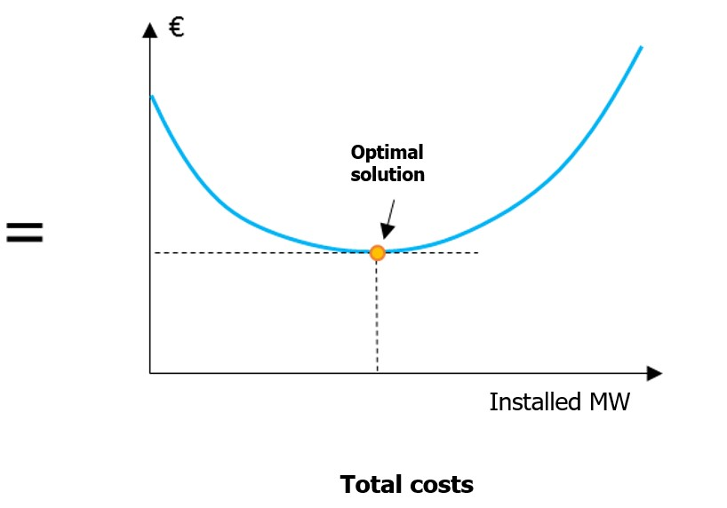

# Introduction

[Antares-Xpansion](https://antares-simulator.org/)  package works along with RTE's adequacy software ANTARES:
<https://antares.rte-france.com/>

**Antares-Xpansion** is the package which optimizes the installed
capacities of an ANTARES study.

Typical uses of the package are for:

> **long-term scenario building**: build an economically consistent
> long-term generation mix

> **transmission expansion planning**: compute the network
> development which maximizes social welfare

The investment decisions are optimized by running ANTARES' simulations
iteratively. At each iteration, the installed capacity of the
investments are updated, and the simulations are repeated until the
total costs have converged to a minimum. The total cost evaluated in
this problem are the sum of **the expected operation cost during one
year** and **the investment annuity**.

**Antares-Xpansion** is currently under development. Feel free to submit
any issue.

## Optimal dimensioning of generation and transport capacities: the optimization problem solved by Antares-Xpansion

The cost function that **Antares-Xpansion** minimizes is as follows:

*Min (expected operating costs for one year + a fixed cost annuity)*

In which the expected operating costs for one year, calculated by
ANTARES, includes the variable costs of thermal generation (fuel and CO2
costs), penalties in case of unsupplied energy, line transit costs (if
any), and, if the expansion-accurate mode is used, the start-up costs of
the thermal generation units. The production costs are calculated over
the entire geographical perimeter of the ANTARES study, and in
expectation over the probabilistic scenarios defined in the study. The
expected operating costs for one year include the fixed operating and
maintenance costs of the generation and transit costs and, in the case
of new units, the fixed cost annuity.

In the case of a problem with a single investment variable, the above
cost function can be represented by the graph in ***Figure 1***.

**Figure** **1** – Objective function of the **Antares-Xpansion**
optimization problem for one candidate

The expected operating costs for one year decreases as installed
capacity increases. New generation or transmission capacity indeed
reduces the variable operating costs of the power system by substituting
"expensive" generation (or penalty in case of unsupplied energy) with
generation from a more low cost source. The marginal contribution of the
investment on this component of the cost function is decreasing: the
first MW installed take the most interesting economic potential and have
a greater impact on generation costs than the "last" MW installed, which
have a lower economic utility, or even none in the case of overcapacity.

In **Antares-Xpansion**, fixed cost annuities are considered piecewise
linear. Different potentials are defined, each of which is characterized
by a fixed cost annuity in €/MW installed, and corresponds to one of the
slopes of the function. A particular case of this commonly used
representation of fixed cost annuities is a fully linear function, and
therefore characterized by a single fixed cost (in €/MW installed).

The final cost result - which will be called the total cost later in
this document - is a convex function. It therefore has a minimum
solution plateau (see ***Figure 2***) which in most applications on real
data sets is reduced to a single point (see ***Figure 1***), but it can
be more than one point of equal value. **Antares-Xpansion** determines
this point which minimizes the total cost, or any point of the minimum
plateau in the case of a so-called degenerate problem. This is the
optimal solution to the cost minimization problem.

**Figure** **2** – Generic case (but uncommon in practical
**Antares-Xpansion** cases) with a set of optimal solutions (a plateau).

The investment variables are the installed capacities (in MW) of the
generation and/or transmission assets defined at the input of
**Antares-Xpansion** as candidates for investment.

The cases shown in ***Figure 1*** and ***Figure 2*** contain only one
investment variable. The search for the optimal solution is then carried
out over the interval \[0, available potential\], bounded on the left by
zero and on the right by the maximum available potential of the
investment under consideration. The available potential is one of the
input data of **Antares-Xpansion**.

In the more general case with several investment candidates,
**Antares-Xpansion** determines one optimal investment combination, that
is, one combination \((c_{1},c_{2},\ldots,c_{n})\) of the capacities of
the n investment candidates that minimizes the cost function.

The search for this optimal combination is done "at the same time" on
the capacities of all investment candidates, and not candidate by
candidate. In doing this, the **Antares-Xpansion** algorithm is able to
identify and take into account the impact of synergies between
structures - for example an A-B line which only becomes interesting once
the B-C line is built - or of competitions - for example an A-B-C
corridor parallel to another A-D-C corridor.

The definition of the investment variables in **Antares-Xpansion** is
detailed later in this note. For example, it may include:

- > Investable capacity values limited to a
  > finite set rather than a whole interval. This allows for
  > example to make the hypothesis that the investment is made in unit
  > steps of 200 MW and to constrain the search for
  > **Antares-Xpansion** to the discrete set {0 MW, 200 MW, 400 MW,
  > 600 MW…}. Or to adopt an all-or-nothing approach in which only two
  > choices are possible: not to invest or to invest up to an imposed
  > unit capacity. Note that **Antares-Xpansion** can manage a mix of
  > continuous investment variables, i.e. valid over the whole
  > interval \[0, maximum potential\], and discrete variables, valid
  > only over a finite set of values (see later).

- Linear constraints between investable
  capacities. Linear constraints between variables can be
  defined in investment problems. For example, they may require the
  sum of the capacities of two investment candidates to be greater or
  less than a given limit.

The resolution method used by **Antares-Xpansion** - called Benders
decomposition - is an iterative method, which for each iteration:

- performs an ANTARES simulation to evaluate the expected annual
  production costs of a combination of investments,

- determines a new investment combination by solving a "master
  problem" in which the cost function is approximated by its
  derivatives into the previously tested investment combinations.
  These derivatives are also called Bender cuts.

This method has been shown to converge towards the optimal solution to
the minimization problem presented in the previous sections. The Benders
decomposition algorithm is also commonly used in the solution of large
stochastic problems. The number of iterations needed to reach the
optimum depends strongly on the structure of the problem and the
variants/algorithmic parameters used. At first order of magnitude, it
increases strongly with the number of defined investment variables.

| **Number of investment candidates** | **Order of magnitude of the number of iterations** |
| ----------------------------------- | -------------------------------------------------- |
| 5                                   | 10                                                 |
| 10                                  | 40                                                 |
| 25                                  | 100                                                |
| 50                                  | 300                                                |
| 100                                 | 800                                                |

**Table** **1 -** Order of magnitude of the number of iterations
required to reach the optimum with **Antares-Xpansion** v0.12. Note that
the number of iterations is also highly dependent on the structure of
the ANTARES study and investment candidates, as well as the algorithmic
parameters of **Antares-Xpansion**.

Each iteration of the **Antares-Xpansion** algorithm includes an ANTARES
simulation. However, the simulation of "operational" studies of several
tens of nodes and with several hundred Monte-Carlo scenarios (TYNDP,
Generation adequacy report on the electricity supply-demand, etc.)
requires a significant amount of computing time, sometimes several
hours. The search for the optimal solution to the problem solved by
**Antares-Xpansion** can therefore be relatively long, and in some cases
requires simplifying the problem being solved.
