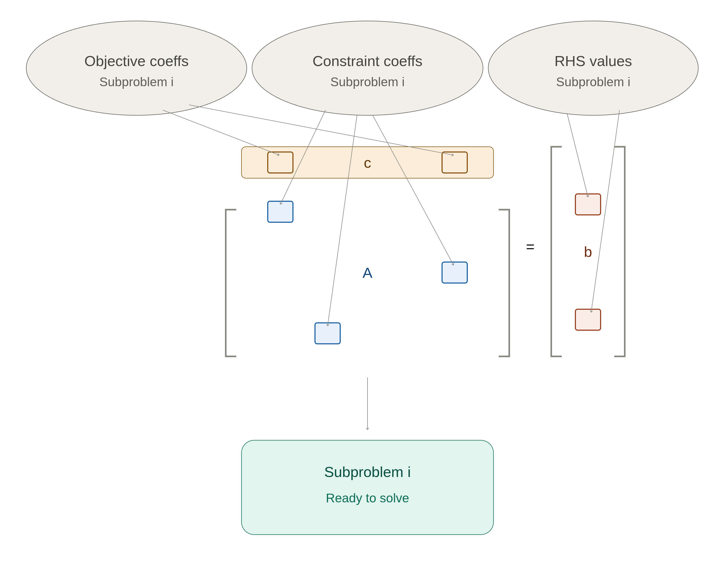
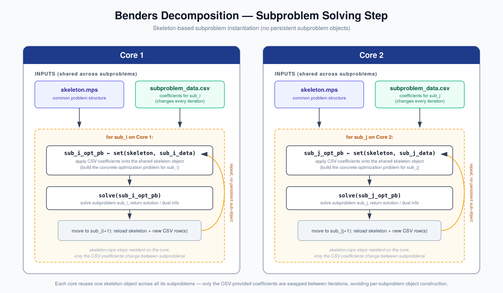

# Using disk-efficient subproblem storage 

## Motivation


#### CACHE_PROBLEMS = 0
In the Benders decomposition framework, the resolution starts by loading the
MPS/SVF files of all the subproblems, so that each of them is held in memory as
a fully instantiated optimization problem for the whole duration of the run. 


#### CACHE_PROBLEMS = 1
A first RAM usage optimization has been implemented by loading the optimization problem from disk just before solving it.

#### CACHE_PROBLEMS = 2
However, the disk footprint of the input data remains drastically high and can become problematic as the number and size of subproblems increase, potentially becoming the bottleneck before computation even starts.

Yet this cost is largely redundant: the subproblems share a huge part of their columns and rows — the
same variables, the same constraint structure — differing only on certain coeffecient values.

The idea is to exploit this redundancy by no longer
providing one MPS file per subproblem, but a single MPS file acting as a
*skeleton*: the common structure shared by all subproblems. We will have an instance per proc. This skeleton is
complemented by a set of much lighter files, one per subproblem, containing
only the subproblem-specific data needed to instantiate the actual problem at
resolution time. Memory then holds one copy of the shared structure instead of
one full problem per subproblem, and the per-subproblem memory footprint is reduced to its
lightweight specialization data. 





## Study format

A memory-optimized study no longer provides one MPS/SVF file per subproblem.
Instead, the subproblems are described by a single skeleton problem together
with a set of CSV files containing the per-subproblem data. In the following,
*rows* and *columns* are understood in the MPS sense: rows are the constraints
and columns are the variables of the optimization problem. The study is given
under the following format:

- **`sub.mps` / `sub.svf`** — the core of the optimization problem, common to
  all the subproblems. This skeleton carries the full structure shared by every
  subproblem; only the coefficients listed in the CSV files below differ from
  one subproblem to another.

- **`coef.csv`** — each row of this file corresponds to one subproblem and
  contains the coefficients to set in the constraint matrix in order to build
  that subproblem from the skeleton.

  Example:

```csv
sub/sub_1.mps,100,220,300
sub/sub_2.mps,300,300,300
```

- **`coef_cols.csv`** — contains the column names on which the constraint
  matrix coefficients of `coef.csv` must be set.

  Example:

```csv
z[line_1],z[Line_2],z[line_3]
```

- **`coef_rows.csv`** — contains the row names on which the constraint matrix
  coefficients of `coef.csv` must be set. Together, `coef_rows.csv` and
  `coef_cols.csv` define the positions in the matrix, and each line of
  `coef.csv` provides the values to write at these positions for the
  corresponding subproblem.

  Example: 

```csv
constraint_1,constraint_2,constraint_3
```

- **`obj_coef.csv`** — contains the coefficients to set in order to build the
  objective function of the corresponding subproblem.

  Example:

```csv
sub/sub_1.mps,1.001,1.02,-1.2
sub/sub_2.mps,1.001,1.02,-1.2
```

- **`obj_cols.csv`** — contains the column names on which the objective
  coefficients of `obj_coef.csv` must be set.

  Example:

```csv
redispatching_1,redispatching_2,redispatching_3
```

- **`rhs.csv`** — contains the values to set on the right-hand side in order to
  build the corresponding subproblem.

  Example:

```csv
sub/sub_1.mps,83,84,92
sub/sub_2.mps,23,45,44
```

- **`rhs_rows.csv`** — contains the row names on which the RHS values of
  `rhs.csv` must be set.

  Example:

```csv
branch_line_1,branch_line_2,branch_line_3
```


At resolution time, a given subproblem is therefore obtained by loading the
skeleton and applying its line of `coef.csv`, `obj_coef.csv` and `rhs.csv` at
the positions designated by the name files.


## Memory optimization Resolution process  


