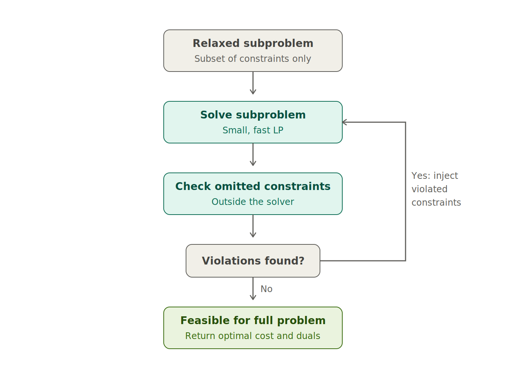

# Micro Iterations

## Core concept

The micro-iterations paradigm applies a constraint-generation scheme (lazy-constraint) at the subproblem level. Instead of instantiating the full set of operational
constraints from the outset, each subproblem is initially built with only a
subset of them, yielding a relaxed problem that is considerably smaller and
faster to solve.

This relaxation is solved a first time, and the resulting solution is handed to
a verification mechanism whose role is to check, outside of the optimization
itself, whether the constraints that were left out of the model are satisfied
by the current solution. The constraints found to be violated are injected into
the subproblem, which is then re-solved with this enriched formulation.

This solve–check–inject sequence constitutes one *micro-iteration*, and it is
repeated until the verification step detects no further violation. At that
point, the solution of the relaxed problem is feasible for the complete
formulation — and therefore optimal for it, since removing constraints can only
relax the problem.

The subproblem thus returns exactly the same optimal value and dual information
as if it had been solved with all constraints from the start, but the solver
only ever handles the constraints that actually matter: in practice, a large
share of the operational constraints are inactive at the optimum, and the
successive relaxations remain far smaller than the full problem.

**`Warm start`**

Because Benders decomposition solves the subproblems repeatedly across
successive iterations, the micro-iterations scheme can carry its learning over
from one iteration to the next. Rather than rebuilding each subproblem from its
minimal relaxed formulation and re-discovering the relevant constraints from
scratch, the warm-start mechanism initializes the subproblem with the
constraints that had been injected during the previous iteration's
solve–check–inject sequence. These constraints are known to have been active
(i.e. binding or violated) for the previous master solution, and since
successive master solutions usually remain close to one another, a large share
of them are still needed. Starting from this enriched formulation typically
requires far fewer micro-iterations to reach feasibility, at the cost of a
slightly larger initial problem. The trade-off is favorable in practice: the
constraints carried over from the previous iteration are precisely those most
likely to matter again, so the relaxation remains small while skipping most of
the redundant solve–check–inject cycles.

## Launching a study with micro-iterations

The micro-iterations mode is enabled through the simulation settings by setting
`MICRO_ITERATIONS: true`. When this mode is active, the study must
be enriched with additional inputs that describe the constraints excluded from
the initial subproblems and provide the machinery needed to detect their
violation. Compared to a standard study, the following elements must be added:

- **`MICRO_ITERATIONS: true`**  in the `options.json` file, see [Settings of benders executable](./options.md) — the simulation variable that activates the
  micro-iterations mode. Without it, the study is solved with the classical
  scheme in which each subproblem carries its full set of constraints from the
  start.

- **MPS/SVF files for the removed constraints** — in addition to the MPS/SVF
  files representing the initial (relaxed) subproblem optimization problems,
  the study must provide MPS/SVF files describing the constraints that were
  removed from the initial formulation. These files are the pool from which
  violated constraints are injected into the subproblems at each
  micro-iteration.

- **A `plugin_inputs` folder** — this folder contains the artefacts needed to
  determine, from a subproblem solution, which of the removed constraints are
  violated. In particular, it can contain an external library that is
  dynamically linked at runtime to evaluate the violated constraints from the
  current subproblem solution.

- **A `variables_to_follow.txt` file** — this file lists the ids of the
  variables whose values must be extracted from the subproblem solution in
  order to evaluate the removed constraints and detect violations.