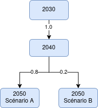

# Trajectory investment problem
## General description

Recall the annual investment problem in Xpansion :

$$
\min_{x \in \mathcal{X}} \quad C^T x + \text{ANTARES}(x)
$$

over a set of investment variables specified by the user, where :

- $x$ is the vector of the capacities installed for each candidate
- $C$ contains the fixed cost annuities of those candidates
- $\text{ANTARES}(x)$ is the operating cost of the system for a given investment level.

## Switching to a pluriannual vision

We want to switch to a pluriannual vision and optimise the investments over several possible trajectories described on a diverging tree of scenarios

{: .center}

**Figure 1** - Trajectory tree made up of annual Xpansion studies

The optimisation problem we now want to solve is, denoting by $n \in \mathcal{T}$ a node in the tree:

$$
\begin{aligned}
    \min_{x, dx^+, dx^-} \quad & \sum_{n \in \mathcal{T}} wIC_n^T dx_n^+ + wDC_n^T dx_n^- + wOC_n^Tx_{n} + w_{n} \times ANTARES_n(x_n)\\\\
    \text{s.t.} \quad & \forall i,n \quad  x_{i,n} = x_{i, \text{parent}(n)} + dx^+_{i,n}
    - dx^-_{i,n} \\\\
    & \forall i,n \quad dx^+_{i,n} \geq 0, \quad dx^-_{i,n} \geq 0 \\\\
    & \forall i,n \quad 0 \leq x_{i,n} \leq X_{i,n}^{max} \\
\end{aligned}
$$

- $wIC_n$ contains the already weighted (for probability of the node) and discounted one-time payment investment costs per MW.
- $wDC_n$ contains the already weighted (for probability of the node) and discounted one-time payment retirement costs per MW.
- $wOC_n$ contains the already weighted (for represented duration of the node & probability) and discounted operation and maintenance fixed costs.
- $w(n) = P(n) \times \sum_{y = y_n}^{y = y_n + d_n - 1} \frac{1}{(1+r)^{y - y_0}}$.
- $P(n)$ is the probability of realisation of node $n$ : $P(n) = P_{\text{parent}(n)}(n) \times P(\text{parent}(n))$.
- $P(root) = 1$.

!!! note "On the $dx^{+/-}$ variables"

    In our model, $x_{i,n}$ is the capacity available during the period represented by $n$, and this means the decisions $dx_{i,n}^{+/-}$ represent the variation of capacity during the period between $\text{parent}(n)$ and $n$ (i.e. the capacity being built or decommisionned during the period represented by $\text{parent}(n)$, with effective entry into service at the beginning of $n$).

    We can impose the decisions to be the same in all children of a given node (see [trajectory constraints](./merge-master.md#trajectory-constraints)) if we want the investment decision of a given period to be independent of what scenario will materialize in the next period when the new capacities enter into service.

    In the example from **Figure 1**, this would mean that the capacity we install in the period [2040, 2050] is independent of wether ```2050_A``` or ```2050_B``` will be realised.