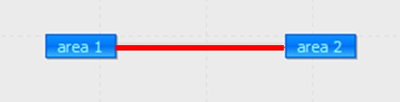
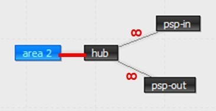

# The user/expansion/ folder of the ANTARES study

The **Antares-Xpansion** package is based on the ANTARES software and
its data format.

**Antares-Xpansion** is based on an already existing ANTARES study. Some
of the capacities of this study, usually fixed as input in the ANTARES
paradigm, will be optimized by the investment optimization module of the
**Antares-Xpansion** package.

In order to run the investment optimization module, the ANTARES dataset
must be enriched with - at least - two new files:

- a ***candidates.ini*** file which contains the definition of
  investment candidates (which capacities of the ANTARES study are
  expandable? at what cost? with what limits? etc.);

- a ***settings.ini*** file which contains the settings of the
  **Antares-Xpansion** algorithm.

These two files must be located in the **user/expansion/** directory of
the ANTARES study (see ***Figure 3***). To date, the data they contain
are neither visible nor modifiable in the ANTARES man-machine interface.
These two files must therefore be built "by hand".

**Figure** **3** – Enrichment of the ANTARES dataset with the addition
of the user/expansion/ directory, which contains the data required for
successful use of **Antares-Xpansion**.

### Definition of investment candidates in the ANTARES study

The user of the package defines investment candidates.
**Candidate capacities for investment are
necessarily links from an ANTARES study**. During the iterative
process described later, the hourly capacities (direct and indirect) of
the investment candidate links will be modified until the Benders
decomposition converges towards the optimum or one of the shutoff
parameter is reached.

Investment candidates can also be generation assets, or even
flexibilities, by adopting a virtual node logic as described below.

|  |  |  |
| ------------------------------------- | ------------------------------------- | ------------------------------------- |
| **(a)**                               | **(b)**                               | **(c)**                               |

***Figure*** ***4** - Configuration of the ANTARES study for an
investment in **(a)** transmission capacity (new line or grid
reinforcement), **(b)** generation units and **(c)** storage.*

Investment in transmission capacity between two
areas: the ANTARES link candidate for investment, shown in red in
**Figure 4 (a)**, is directly the interconnection for which the interest
in increasing capacity is being studied.

- In the case of the construction of a new line, a link must be added
  in the ANTARES study between the two areas concerned.

- In the case of a grid reinforcement between two already
  interconnected areas, the link between these two areas already
  existed in the ANTARES study. The parameter
  already-installed-capacity is then used in the definition of the
  investment candidate to specify the capacity value of the grid
  structures already present between the two zones. In this way,
  **Antares-Xpansion** will assess the economic interest of increasing
  this capacity beyond what is already installed.

Investment in thermal generation
capacity: The generation capacity subject to expansion,
physically located for the example in **Figure 4 (b)** in *area1*, must
be moved to a virtual node (here *invest\_semibase*) connected to the
physical node *area1*. The ANTARES link of the investment candidate is
the link between these two nodes.

The generation unit of the investment candidate must be defined, with
its technical and economic parameters, by a thermal cluster:

- located in the virtual node (here *invest\_semibase*),

- created before executing the benders decomposition,

- which has a *market bid* equal to its *marginal cost*, which is
  equal to the variable operating cost (in €/MWh) of the generation
  unit,

- which has an hourly availability time series
  **always higher than the potential**
  (max-investment) of the investment candidate (if the hourly
  availability time series of thermal generation are "*ready-made*” in
  ANTARES, then the values of the time series must be filled in such a
  way that they **are always higher**
  than the candidate's potential. If the times series of thermal
  generation are “*stochastic*” i.e. generated by ANTARES, then the
  parameters for the generation of series must be defined in such a
  way that the availability is always higher than the potential
  (*number of units* \* *nominal capacity* \> *potential*, no outages
  rate).

Other cluster parameters (*pmin*, *start-up costs*, etc.) can also be
defined. However, they will only be taken into account by
**Antares-Xpansion** if the expansion-accurate mode is used (see later).

Investment in renewable generation
capacity: As in the case of thermal generation, the renewable
generation capacity subject to expansion, physically located for the
example in **Figure 4 (b)** in *area1*, must be moved to a virtual node
connected to the physical *area1* node. The investment candidate's
ANTARES link is the link between these two nodes.

For the type of renewable production concerned (wind or solar), a
production time-series (ANTARES wind or solar tab) must be defined in
the virtual node. The production time-series must be deterministic,
constant, and **higher than the
potential** (max-investment) of the investment candidate. The
parameter link-profile will then be used (see later) to define the
hourly load factor. It should be noted that this profile is necessarily
deterministic and that the new renewable generation capacities cannot
have differentiated production time-series for each Monte-Carlo year.

Investment in flexibility: The modeling
of flexibilities, such as Pumped storage, is generally based in ANTARES
on a set of virtual nodes/links and coupling constraints. To make
flexibility an investment candidate, a link must be identified in the
ANTARES modelling whose transmission capacity corresponds to the
capacity of the flexibility (at its maximum power for example, the size
of a stock, etc.). For example, in the case of the Pumped storage in
**Figure 4 (c)**, the capacity of the Pumped storage (equal to its pump
and turbine capacity) is defined by the maximum possible flow on the
link between *area2* and *hub*: it is by this link that the investment
in this flexibility will be characterized. The classical binding
constraints must be added in the ANTARES simulation to represents the
storage (for example: with a negative ROW Balance in psp-in and a
positive ROW Balance in psp-out and the following constraint).

In the 4 cases presented above, the link used to define investment
candidates (in red in **Figure 4**):

- must have the parameter *« transmission capacities = use
  transmission capacities* », and not « *set to null* » or « *set to
  infinite* »,

- may have a *hurdle cost*, which will then be well taken into account
  in the economic optimization of **Antares-Xpansion**,

- may be subject to binding constraints - provided that the ANTARES
  version used is at least v6.1.3 - which will be well taken into
  account in the simulations of system operation. These constraints
  can possibly be constructed by the Kirchhoff constraint generator
  and the information given in the impedances, loop flow and phase
  shift columns of the link.

The direct and indirect transmission capacities of the link will be
modified by **Antares-Xpansion**. The values initially entered in the
*Trans.* *Capacity Direct* and *Trans. Capacity Indirect* columns do not
matter since they will be overwritten when the expansion problem is
solved. Note that the capacities of existing structures must be filled
in with the already-installed-capacity parameter in the *candidates.ini*
file (see later) and not in the definition of the links in the ANTARES
study.
