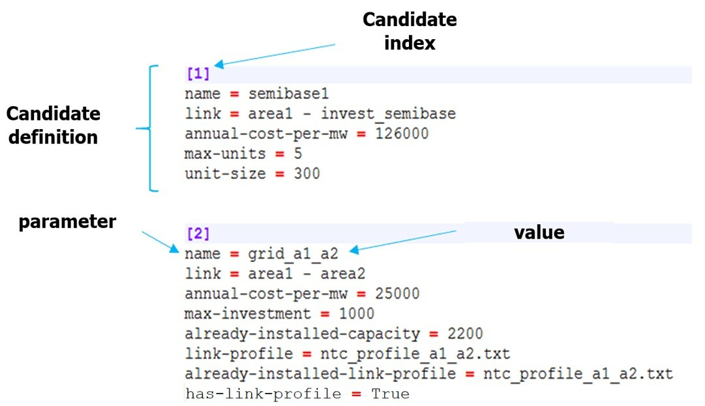
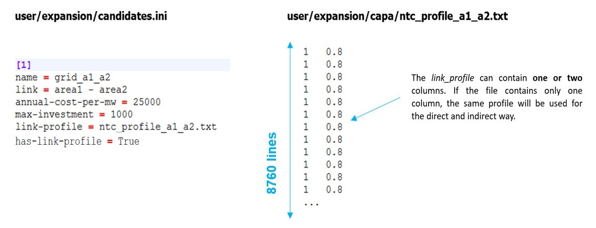

# Definition of investment candidates in the *candidates.ini* file

Not all links in the ANTARES study are by default investment candidates.
The selection of expansion capacities is left to the user and is defined
in the *candidates.ini* file. Each investment candidate is characterized
with the following properties:

- > **name**: name of the investment candidate (warnings : must not
  > contains spaces)

- > **link**: link whose capacity will be invested

- > **annual cost per MW**: investment cost, per year and per MW

- > **unit size**: size, in MW, of an investment unit (e.g. one group
  > of 300 MW)

- > **maximum units**: maximum number of units which can be built

- > **has link profile**: True if candidate has a capacity profile

The *candidates.ini* file must respect the following syntax:

**Figure** **5** – Example of a candidates.ini file

Concretely, the investment decision will affect only the capacity of the
ANTARES' links. Investing in interconnections can be made directly with
the package, while investing in generation capacity or storage capacity
can be made using the so-called concept of "virtual nodes" with ANTARES.
The definition of all the investment candidates is given in a new input
file, located in the user folder of the study:
./user/expansion/candidates.ini.

The parameters that characterize the candidates are as follows:

**name (mandatory parameter)**

The value to be entered is a string. It specifies the name of the
investment applicant. This name is reused in the logs and outputs of
**Antares-Xpansion**.

Warnings: This field must not contain spaces\!

**link (mandatory parameter)**

The value to be entered is a string. It defines the link of the ANTARES
study candidate for investment, whose capacities (direct and indirect)
will be modified by **Antares-Xpansion**. The syntax of the link name
includes the names of the two ANTARES nodes that the link connects,
separated by "-", for example:

origin\_area – destination\_area

Note that node names that include spaces or dashes are not compatible
with **Antares-Xpansion**. The origin area corresponds to the first in
the spelling order. The same link may contain several investment
candidates (see section later).

**annual-cost-per-mw (mandatory
parameter)**

The value to be filled in is numeric (the decimal separator is the
point). It defines the investment candidate's fixed cost annuity (in
€/MW/year). Depending on the type of candidate (see section 2.3.3),
the fixed cost annuity can include:

- fixed operation and maintenance costs

- an investment cost annuity

**max-investment**

The value to be entered is numerical. It represents the candidate's
potential, i.e. the maximum capacity (in MW) that can be invested in
this candidate. If the candidate has this parameter, the set of values
that its capacity can take is the interval \[0, max-investment\].

The definition of an investment candidate must necessarily include
either (i) a maximum potential in MW (max-investment) or (ii) a unit
size in MW (unit-size) and a maximum potential in number of units
(max-units).

**unit-size**

The value to be entered is numerical. It defines the nominal capacity
(in MW) of the investment candidate's installable units.

**max-units **

The value to be entered is an integer. It corresponds to the candidate's
potential in terms of number of installable units. If the candidate has
the max-units and unit-size parameters, then the set of values that its
capacity can take is the finite set of the first multiples of unit-size:

{0, unit-size, 2 x unit-size, … , max-units \* unit-size}

**already-installed-capacity**

The value to be entered is numerical. It corresponds to a capacity
already installed on the investment candidate's link. If
**Antares-Xpansion** considers the investment in this investment
candidate to be economically relevant, the new capacity invested will be
added to the already installed capacity. The transmission capacities
initially indicated in the ANTARES study are not considered in the
already-installed-capacity parameter and will be overwritten by
**Antares-Xpansion**.

**has-link-profile**

The value to be entered is True if the candidate has a link profile.

**link-profile**

The value to be filled is a string specifying the name of a file. This
file must be located in the *user/expansion/capa/* directory of the
ANTARES study. It must contain one or two columns of 8760 numerical
values (the decimal separator is the point). The link-profile makes the
link between the capacity invested and the capacity actually available,
in the direct and indirect directions of the ANTARES link for the 8760
hours of the year. The link-profile can for example be used to represent
the maintenance of a generation asset via a seasonalized power outage,
or the average load factor of intermittent renewable generation, defined
at hourly intervals. It should be noted that the link-profile is
deterministic: the same profile will be used by **Antares-Xpansion** for
all Monte-Carlo years of the ANTARES study and all capacity tested.

**Figure** **6** – Example of a file containing a load factor profile in
the **Antares-Xpansion** format

**already-installed-link-profile**

The value to be filled is a string specifying the name of a file. This
file must be located in the *user/expansion/capa/* directory of the
ANTARES study and have the same format as a link-profile (see ***Figure
6***). The already-installed-link-profile makes the link between the
capacity invested and the hourly capacity actually available, in the
direct and indirect way of the Antares link for the 8760 hours of the
year. It should be noted that the same file can be used for link-profile
and already-installed-link-profile of one or more candidates.
