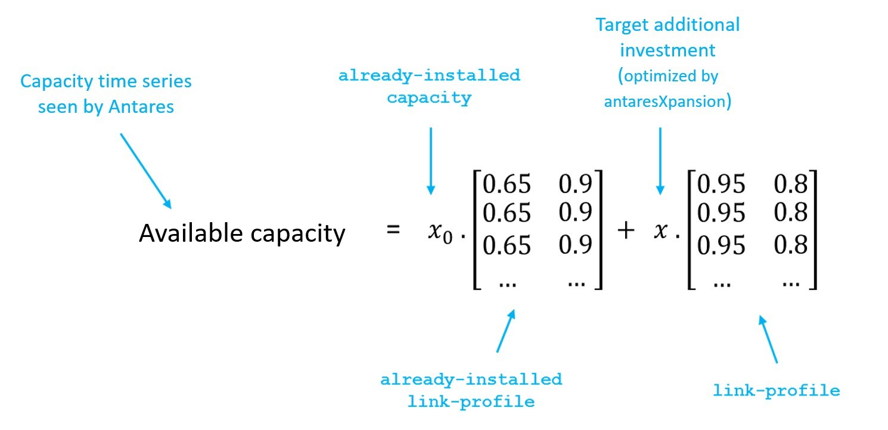

# Link between invested capacity and capacity of the Antares study

The parameter link-profile, already-installed-capacity and
already-installed-link-profile are used to define the link between:

- the capacity installed by **Antares-Xpansion**, and

- the capacity actually available in the ANTARES study, hour by hour
  and in both directions of the link concerned.

- Note that these parameters are only useful if the candidates are
  grid reinforcement.

**Figure** **7** – Link between the capacity invested by
**Antares-Xpansion**, and the capacity available in the ANTARES study

Note that by default, the parameters link-profile and
already-installed-link-profile contain only 1's, thus assuming "perfect"
availability of the invested capacity.

The parameter link-profile is conventionally used for:

- Take into account an NTC profile on an interconnection, possibly
  seasonalized and having a different impact on the direct and
  indirect directions of the link,

- Represent the maintenance of a thermal generation asset by
  considering a deterministic reduction of its power, possibly
  different according to the season (see **Figure 8**),

- Model renewable generation by multiplying the invested capacities by
  a (deterministic) load factor chronicle (e.g. an average chronicle
  or the chronicle of a given Monte-Carlo year).

The investment problem, at this stage of development, makes it possible
to manage the fact of investing in a capacity, whose availability varies
during the year with an average availability over all Monte-Carlo years
via the link\_profile. However, it is not possible to manage an hourly
availability per Monte-Carlo year, which
would make it possible to represent more realistically the intermittency
of RES from one year to another or the impact of outages and maintenance
on an entire unit of thermal power plants (see **Figure 8**).

**Figure** **8 –** Available hourly capacity of different types of power
plants due to outages. **Antares-Xpansion** allows to take into account
an average hourly availability (purple line) via the link\_profile,
which is still very different from the actual hourly availability over a
year.

To validate the results, after having run the benders decomposition a
first time with a deterministic average hourly availability curve, it is
preferable to re-simulate these outages according to a stochastic
process by relaunching an ANTARES simulation with the capacities
obtained by antaresXpansion in order to obtain the real production
program with outages and RES intermittencies varying according to the
scenarios.
