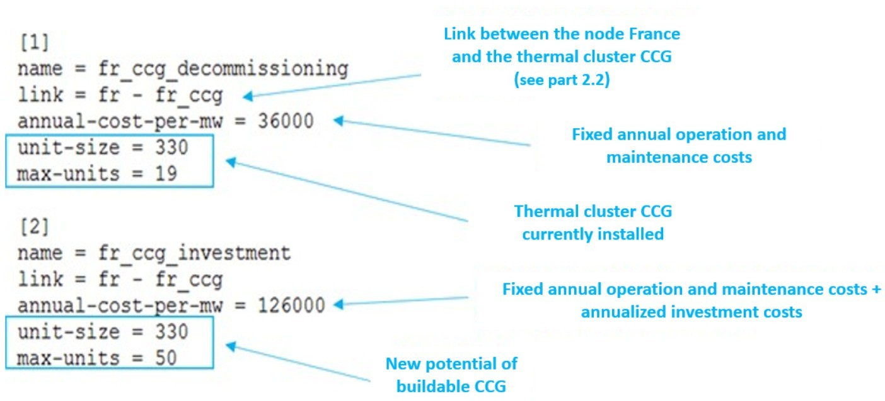

# Investment Candidates and Decommissioning Candidates

Investment candidates and decommissioning candidates are differentiated
by their fixed cost annuities. In the case of decommissioning, there is
no reconsideration of the investment cost, one only chooses whether or
not to maintain operation and maintenance costs:

- The annuity of the investment
  candidates includes the sum of:

    - fixed annual operation and maintenance costs

    - annualized investment costs

> In this configuration, **Antares-Xpansion** makes an economic choice
> between the sum of these costs and the reduction in variable operating
> costs (mainly fuel costs and penalties associated with loss of load)
> made possible by the new investment.

- The annuity for decommissioning
  candidates, on the other hand, only includes the fixed annual
  operation and maintenance costs. In this configuration,
  **Antares-Xpansion** makes an economic choice between the operation
  and maintenance costs of a generation or transmission asset, and the
  savings it makes on the variable costs of power system operation.
  The annualized investment costs are in this case considered as
  stranded and are not taken into account in this economic choice. The
  "potential" of this type of candidate (i.e. its max-investment or
  max-units x unit-size) corresponds to its decommissionable capacity,
  i.e. the candidate's already installed capacity that could be shut
  down if it is no longer profitable for the power system.

Candidates for decommissioning should be explicitly specified in
**Antares-Xpansion** in the name. The generation units already installed
in the ANTARES study, as well as the capacities covered by the
already-installed-capacity parameter of the investment candidates are
fixed and cannot be decommissioned by **Antares-Xpansion**.

By using the functionality presented in the last part, it is possible to
make on the same link:

- A candidate for decommissioning: defined by a capacity already
  installed and by its fixed operation and maintenance costs.

- A candidate for investment: defined by an expandable capacity and a
  fixed annuity of costs including investment costs.

An example of a production process that can be decommissioned or
expanded is given in the following figure.

***Figure*** ***9** - Candidates for investment and decommissioning on
the same link from an ANTARES study*

Warnings : the hourly availability time series of thermal generation CCG
in ANTARES should be higher than the sum of the availability currently
installed with the new potential buildable (availability of CCG cluster
in the virtual node *fr\_ccg* \> 330 x 19 + 330 x 50 with this example).

At the end, for the candidate for decommissioning, the result is inverse
than for the investment candidate: if the result displayed in the
console is: 300 x 19 MW invested, this means that
no units are decommissioned, if the
result displayed in the console is: 0 MW invested it means that
all units have been decommissioned.

