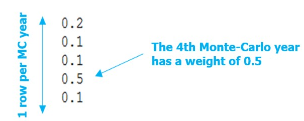

# Parameterization of the algorithm for solving the investment problem

The simulation options and algorithmic parameters for solving the
investment problem must be entered in the settings.ini located in the
folder ./user/expansion/ with the appropriate syntax is given below:

**uc\_type = expansion\_fast**

**master = integer**

**optimality\_gap = 0**

**max\_iteration = 100**

**additional-constraints = constraint.txt**

The various configurable parameters are detailed in the rest of this
section. If a parameter is not filled in the settings.ini file by the
user, it will take its default value.

**optimality-gap**

Possible values: numeric (ex: optimality\_gap = 1e6) in euros. Default
value: 1e-6.

The optimality-gap parameter is a stopping criterion of the
**Antares-Xpansion** algorithm, expressed as a distance to the optimum
of the optimization problem, defined in euros.

If the optimality\_gap is zero, **Antares-Xpansion** will continue its
search until the optimal solution to the investment optimization problem
is found. If the optimality\_gap is strictly positive, search will stop
as soon as **Antares-Xpansion** finds a solution where the cost
difference from the optimum is less than the optimality\_gap.

**Figure** **10** – Illustration of the optimality-gap and the set of
solutions that can be returned by the package when the gap is strictly
positive.

The minus infinity (-Inf)value of the optimality\_gap is theoretically
equivalent to a null optimality\_gap, except that it covers numerical
errors which in practice can lead to an underestimation of the distance
of a solution to the optimum. With this default value,
**Antares-Xpansion** determines the investment combination that
minimizes the cost function.

The interest of a strictly positive optimality\_gap is that it speeds up
research by stopping as soon as a "good" solution is found.

The interpretation of this stopping criterion is not always obvious. It
certainly guarantees that a solution will be found whose cost is close
to the optimum, but it does not provide any information on the distance
(in MW) between the installed capacities of this solution and those of
the optimum solution. However, if the cost function is relatively flat
around the optimum, solutions whose costs are close may have
significantly different installed capacities (see for example **Figure
8**).

**Which settings should I use the** optimality\_gap**?**

- If I have to run several expansion optimizations of different
  variants of a study and compare them. In that case, if the optimal
  solutions are not returned by the package, the comparison of several
  variants can be tricky as the imprecision of the method might be in
  the same order of magnitude as the changes brought by the input
  variations. It is therefore advised to be as closed as possible from
  the optimum of the expansion problem. To do so, the following
  condition should necessarily be fulfilled:

    - set the optimality\_gap to zero.

> Note: even with the conditions mentioned above, the result might be
> slightly different from the optimum due to numeric approximations,
> this can be partly solved by putting to optimality gap to –Inf.

- If I'm building one consistent generation/transmission scenario. As
  the optimal solution is not more realistic than an approximate
  solution of the modelled expansion problem. The settings can be less
  constraining with:

    - an optimality\_gap of a few million euros.

**uc\_type**

Possible values: expansion\_fast and expansion\_accurate. By default:
expansion\_fast.

The uc-type (unit-commitment type) parameter specifies the simulation
mode used by Antares to evaluate the operating costs of the electrical
system:

- If uc\_type = expansion\_fast: the *fast* mode of ANTARES is used,
  deactivating the flexibility constraints of the thermal units (Pmin
  constraints and minimum up and down times), and not taking into
  account either the start-up costs or the impact of the day-ahead
  reserve.

- If uc\_type = expansion\_accurate: the *expansion* mode of ANTARES
  is used. This simulation mode corresponds to the *accurate* mode of
  ANTARES in which the unit-commitment variables are relaxed. The
  flexibility constraints of the thermal units as well as the start-up
  costs are taken into account.

**master**

Possible values: integer and relaxed. By default: integer.

The master parameter provides information on how integer variables are
taken into account in the antaresXpansion master problem.

- If master = relaxed: the integer variables are relaxed, and the
  level constraints of the investment candidates (cf. max-units and
  unit-size) will not be necessarily respected.

- If master = integer: the problem of optimizing investments is solved
  by taking into account unit-size constraints of the candidates.
  However, to speed up the search for the optimal solution, these
  constraints are not taken into account during the first iterations
  of the Benders decomposition: they are relaxed until the
  relaxed-optimality-gap is reached.

For problems with several investment candidates with large max-units,
the master = relaxed can accelerate the search for **Antares-Xpansion**
very significantly.

**max-iteration**

Possible values: strictly positive integer or infinite. Default value:
Inf.

Benders decomposition stop criterion defined in maximum number of
iterations. Once this number of iterations is reached, the search for
**Antares-Xpansion** ends, regardless of the quality of the solution
found.

**Timelimit**

Possible values: strictly positive integer or infinite. Default value:
Inf.

Benders decomposition stop criterion defined in maximum number of
iterations. Once this number of iterations is reached, the search for
**Antares-Xpansion** ends, regardless of the quality of the solution
found.

**yearly-weights**

Value: string specifying the name of a file.

yearly-weights offers the possibility of assuming that the Monte Carlo
years simulated in the ANTARES study are not equally probable. The most
representative years may be given greater weight than those that are
less representative. The yearly-weights points to a vector
\(\left( \omega_{1},\ldots,\omega_{n} \right)\), with \(n\) the number
of Monte-Carlo years in the study, which is used to evaluate the
expected production costs.

\[\mathbb{E}\left\lbrack \text{cost} \right\rbrack = \ \frac{\sum_{i = 1}^{n}{\omega_{i}\text{cost}_{i}}}{\sum_{i = 1}^{n}\omega_{i}}\]

With \(\text{cost}_{i}\) the production cost of the \(i\)-th Monte Carlo
year.

The value to be filled is a string specifying the name of a file. This
file must be located in the *user/expansion/* folder of the ANTARES
study. It must contain a column with as many numerical values as there
are Monte-Carlo years in the ANTARES study. The value of the \(i\)-th
row is the weight of the \(i\)-th Monte Carlo year.

**Figure** **11** – Example of a setting of Antares-Xpansion with
Monte-Carlo years that are not equally-weighted.

If the yearly-weights parameter is not used, the Monte-Carlo years of
the ANTARES study are considered to be equally-weighted.

The yearly-weights parameter **must be set in
line with the ANTARES study playlist by the user**: years with
zero weights must be removed from the ANTARES study playlist in order
not to be simulated unnecessarily.

**additional-constraints**

Value: string specifying the name of a file.

The additional-constraint argument makes it possible to impose linear
constraints between the invested capacities of investment candidates.
The value of this parameter is the name of a file to be located in the
user/expansion/ folder of the ANTARES study. This file must be written
in a particular syntax and complements the master problem with new
linear constraints between investment candidates. The format is inspired
by Antares' binding constraints. An example of such a file is given in
the following figure:

**Figure** **12** – Example of an additional constraint file

- name : constraint name must be unique and must not contain any
  special symbols or space

- sign: direction of the equality : less\_or\_equal, equal or
  greater\_or\_equal

- rhs: numeric second term of the constraint

The user can also optionally use binary constraints to represent, for
example, exclusion constraints. In the following figure,
**Antares-Xpansion** cannot invest in semibase and peak at the same
time, it can also invest in neither:

**Figure** **13** – Example of an additional constraint file

The use of binary variables is not recommended as it greatly increases
the calculation time.

