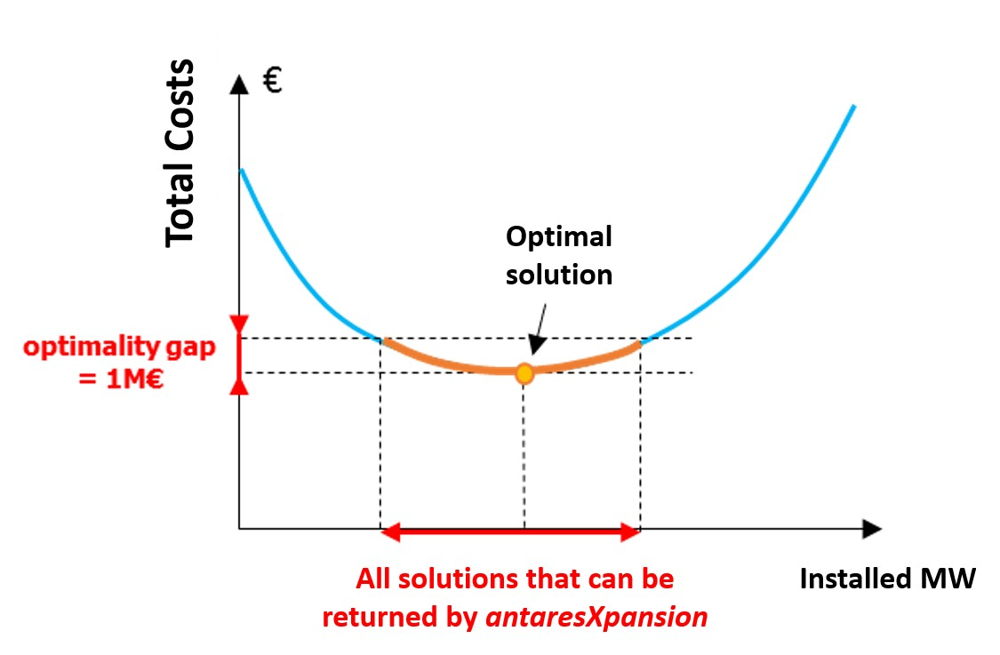
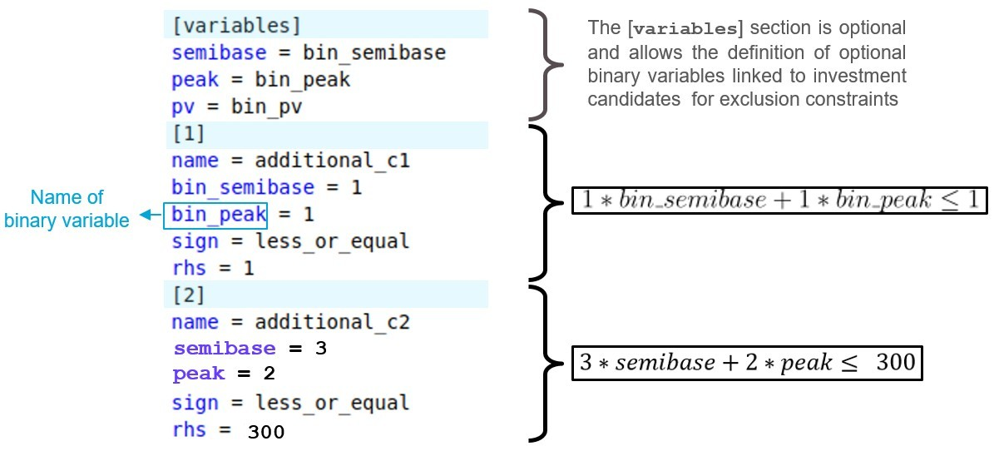

# Prepare a simulation

## The `user/expansion/` folder of the ANTARES study

The **Antares-Xpansion** package is based on the ANTARES software and
its data format.

**Antares-Xpansion** is based on an already existing ANTARES study. Some
of the capacities of this study, usually fixed as input in the ANTARES
paradigm, will be optimized by the investment optimization module of the
**Antares-Xpansion** package.

In order to run the investment optimization module, the ANTARES dataset
must be enriched with - at least - two new files:

- a `candidates.ini` file which contains the definition of
  investment candidates (which capacities of the ANTARES study are
  expandable? at what cost? with what limits? etc.);

- a `settings.ini` file which contains the settings of the
  **Antares-Xpansion** algorithm.

These two files must be located in the **user/expansion/** directory of
the ANTARES study (see ***Figure 3***). To date, the data they contain
are neither visible nor modifiable in the ANTARES man-machine interface.
These two files must therefore be built "by hand".

```
xpansion-study
└─── input
└─── layers
└─── logs
└─── output
└─── settings
└─── user
│   └───expansion
│       │   candidates.ini
│       │   settings.ini
│       │   ...
```

## Definition of investment candidates in the ANTARES study

The user of the package defines investment candidates.
**Candidate capacities for investment are
necessarily links from an ANTARES study**. During the iterative
process described later, the hourly capacities (direct and indirect) of
the investment candidate links will be modified until the Benders
decomposition converges towards the optimum or one of the shutoff
parameter is reached.

Investment candidates can also be generation assets, or even
flexibilities, by adopting a virtual node logic as described below.

|  |  |  |
| ------------------------------------- | ------------------------------------- | ------------------------------------- |
| **(a)**                               | **(b)**                               | **(c)**                               |

***Figure 3*** - Configuration of the ANTARES study for an
investment in **(a)** transmission capacity (new line or grid
reinforcement), **(b)** generation units and **(c)** storage.

### Investment in transmission capacity between two areas 
The ANTARES link candidate for investment, shown in red in
**Figure 3 (a)**, is directly the interconnection for which the interest
in increasing capacity is being studied.

- In the case of the construction of a new line, a link must be added
  in the ANTARES study between the two areas concerned.

- In the case of a grid reinforcement between two already
  interconnected areas, the link between these two areas already
  existed in the ANTARES study. The parameter
  `already-installed-capacity` is then used in the definition of the
  investment candidate to specify the capacity value of the grid
  structures already present between the two zones. In this way,
  **Antares-Xpansion** will assess the economic interest of increasing
  this capacity beyond what is already installed.

### Investment in thermal generation capacity
The generation capacity subject to expansion,
physically located for the example in **Figure 3 (b)** in *area1*, must
be moved to a virtual node (here `invest_semibase`) connected to the
physical node *area1*. The ANTARES link of the investment candidate is
the link between these two nodes.

The generation unit of the investment candidate must be defined, with
its technical and economic parameters, by a thermal cluster:

- located in the virtual node (here `invest_semibase`),

- created before executing the benders decomposition,

- which has a *market bid* equal to its *marginal cost*, which is
  equal to the variable operating cost (in €/MWh) of the generation
  unit,

- which has an hourly availability time series
  **always higher than the potential**
  (max-investment) of the investment candidate (if the hourly
  availability time series of thermal generation are "*ready-made*” in
  ANTARES, then the values of the time series must be filled in such a
  way that they **are always higher**
  than the candidate's potential. If the times series of thermal
  generation are “*stochastic*” i.e. generated by ANTARES, then the
  parameters for the generation of series must be defined in such a
  way that the availability is always higher than the potential
  (*number of units* \* *nominal capacity* \> *potential*, no outages
  rate).

Other cluster parameters (*pmin*, *start-up costs*, etc.) can also be
defined. However, they will only be taken into account by
**Antares-Xpansion** if the expansion-accurate mode is used (see later).

### Investment in renewable generation capacity
As in the case of thermal generation, the renewable
generation capacity subject to expansion, physically located for the
example in **Figure 4 (b)** in *area1*, must be moved to a virtual node
connected to the physical *area1* node. The investment candidate's
ANTARES link is the link between these two nodes.

For the type of renewable production concerned (wind or solar), a
production time-series (ANTARES wind or solar tab) must be defined in
the virtual node. The production time-series must be deterministic,
constant, and **higher than the
potential** (max-investment) of the investment candidate. The
parameter `link-profile` will then be used (see later) to define the
hourly load factor. It should be noted that this profile is necessarily
deterministic and that the new renewable generation capacities cannot
have differentiated production time-series for each Monte-Carlo year.

### Investment in flexibility
The modeling of flexibilities, such as Pumped storage, is generally based in ANTARES
on a set of virtual nodes/links and coupling constraints. To make
flexibility an investment candidate, a link must be identified in the
ANTARES modelling whose transmission capacity corresponds to the
capacity of the flexibility (at its maximum power for example, the size
of a stock, etc.). For example, in the case of the Pumped storage in
**Figure 3 (c)**, the capacity of the Pumped storage (equal to its pump
and turbine capacity) is defined by the maximum possible flow on the
link between *area2* and *hub*: it is by this link that the investment
in this flexibility will be characterized. The classical binding
constraints must be added in the ANTARES simulation to represents the
storage (for example: with a negative ROW Balance in psp-in and a
positive ROW Balance in psp-out and the following constraint).


In the 4 cases presented above, the link used to define investment
candidates (in red in **Figure 4**):

- must have the parameter *« transmission capacities = use
  transmission capacities* », and not « *set to null* » or « *set to
  infinite* »,

- may have a *hurdle cost*, which will then be well taken into account
  in the economic optimization of **Antares-Xpansion**,

- may be subject to binding constraints - provided that the ANTARES
  version used is at least v6.1.3 - which will be well taken into
  account in the simulations of system operation. These constraints
  can possibly be constructed by the Kirchhoff constraint generator
  and the information given in the impedances, loop flow and phase
  shift columns of the link.

The direct and indirect transmission capacities of the link will be
modified by **Antares-Xpansion**. The values initially entered in the
*Trans.* *Capacity Direct* and *Trans. Capacity Indirect* columns do not
matter since they will be overwritten when the expansion problem is
solved. Note that the capacities of existing structures must be filled
in with the `already-installed-capacity` parameter in the *candidates.ini*
file (see later) and not in the definition of the links in the ANTARES
study.

## Definition of investment candidates in the *candidates.ini* file

Not all links in the ANTARES study are by default investment candidates.
The user selects the investments candidates by specifying them in the
`candidates.ini` file. Each investment candidate is characterized
with the following properties:

- **`name`**: name of the investment candidate (:warning: must not
  contain spaces and unique)

- **`link`**: link whose capacity will be invested

- **`annual-cost-per-MW`**: investment cost, per year and per MW

- **`unit-size`**: size, in MW, of an investment unit (e.g., one group
  of 300 MW)

- **`maximum units`**: maximum number of units which can be built

### The `candidates.ini` file

The `candidates.ini` must be placed inside the Antares study folder  
`ANTARES-STUDY-FOLDER/user/expansion/candidates.ini`.
The format is a standard `.ini` and should follow this template:


**Figure 4** – Example of a candidates.ini file

Concretely, the investment decision will affect only the capacity of the
ANTARES' links. Investing in interconnections can be made directly with
the package, while investing in generation capacity or storage capacity
can be made using the so-called concept of "virtual nodes" with ANTARES.
The definition of all the investment candidates is given in a new input
file, located in the user folder of the study:
`./user/expansion/candidates.ini`.

The parameters that characterize the candidates are as follows:

#### `name` (mandatory parameter)

The value to be entered is a string. It specifies the name of the
investment applicant. **Antares-Xpansion** will use this name
in the output and the logs.

> :warning: This field must not contain spaces!

#### `link` (mandatory parameter)

The value to be entered is a string. It defines the link of the ANTARES
study candidate for investment, whose capacities (direct and indirect)
will be modified by **Antares-Xpansion**. The syntax of the link name
includes the names of the two ANTARES nodes that the link connects,
separated by "-", for example:
```
origin_area – destination_area
```

Note that node names that include spaces or dashes are not compatible
with **Antares-Xpansion**. The origin area corresponds to the first in
the spelling order. The same link may contain several investment
candidates (see section later).

#### `annual-cost-per-mw` (mandatory)

The value to be filled in is numeric (the decimal separator is the
point). It defines the investment candidate's fixed cost annuity (in
€/MW/year). Depending on the type of candidate (see section 2.3.3),
the fixed cost annuity can include:

- fixed operation and maintenance costs

- an investment cost annuity

#### `max-investment`

The value to be entered is numerical. It represents the candidate's
potential, i.e. the maximum capacity (in MW) that can be invested in
this candidate. If the candidate has this parameter, the set of values
that its capacity can take is the interval \\([0, max-investment]\\).

The definition of an investment candidate must necessarily include
either (i) a maximum potential in MW (max-investment) or (ii) a unit
size in MW (`unit-size`) and a maximum potential in number of units
(max-units).

#### `unit-size`

The value to be entered is numerical. It defines the nominal capacity
(in MW) of the investment candidate's installable units.

#### `max-units`

The value to be entered is an integer. It corresponds to the candidate's
potential in terms of number of installable units. If the candidate has
the max-units and `unit-size` parameters, then the set of values that its
capacity can take is the finite set of the first multiples of `unit-size`:
$$[0, \text{unit-size}, 2 \cdot \text{unit-size}, … , \text{max-units} \cdot \text{unit-size}]$$

#### `already-installed-capacity`

The value to be entered is numerical. It corresponds to a capacity
already installed on the investment candidate's link. If
**Antares-Xpansion** considers the investment in this investment
candidate to be economically relevant, the new capacity invested will be
added to the already installed capacity. The transmission capacities
initially indicated in the ANTARES study are not considered in the
`already-installed-capacity` parameter and will be overwritten by
**Antares-Xpansion**.


#### `link-profile`

The value to be filled is a string specifying the name of a file. This
file must be located in the `user/expansion/capa/` directory of the
ANTARES study. It must contain one or two columns of 8760 numerical
values (the decimal separator is the point). The `link-profile` makes the
link between the capacity invested and the capacity actually available,
in the direct and indirect directions of the ANTARES link for the 8760
hours of the year. The `link-profile` can for example be used to represent
the maintenance of a generation asset via a seasonalized power outage,
or the average load factor of intermittent renewable generation, defined
at hourly intervals. It should be noted that the `link-profile` is
deterministic: the same profile will be used by **Antares-Xpansion** for
all Monte-Carlo years of the ANTARES study and all capacity tested.


**Figure 5** – Example of a file containing a load factor profile in
the **Antares-Xpansion** format

#### `already-installed-link-profile`

The value to be filled is a string specifying the name of a file. This
file must be located in the `user/expansion/capa/` directory of the
ANTARES study and have the same format as a `link-profile` (see ***Figure
5***). The `already-installed-link-profile` makes the link between the
capacity invested and the hourly capacity actually available, in the
direct and indirect way of the Antares link for the 8760 hours of the
year. It should be noted that the same file can be used for `link-profile`
and `already-installed-link-profile` of one or more candidates.

### Examples of candidates

An example with two investments candidates, one in semi-base generation
and one in network capacity, is given below.


The invested semi-base generation in *area 1* is shifted in the "virtual
node" *`invest_semibase`*. Within the optimization process, the capacity
of the link between area 1 and *`invest_semibase`* will be updated with
the new invested capacity.

The candidates.ini file for this example will be the following one. This
file has to be saved in the folder ./user/expansion/:

```ini
[1]
name = semibase
link = area1 - invest_semibase
annual-cost-per-mw = 126000
unit-size = 200
max-units = 5
already_installed_capacity = 200

[2]
name = grid
link = area1 - area2
annual-cost-per-mw = 3000
unit-size = 500
max-units = 4
```

Another example with solar generation in a virtual node:

```ini
[1]
name = solar_power
link = area1 - pv1
annual-cost-per-mw = 100000
max-investment = 10000
link-profile = pv1.txt
```
Where `pv1.txt` is a text file, located in the `./user/expansion/capa/`
folder of the study, and which contains the load factor time series of
the candidate (one column of 8760 values between 0 and 1, or two columns
if there is a direct and indirect profile on the link). When x MW of the
candidate *`solar_power`* will be invested, the actual time series of
available power will be equal to the product of x and the time series
pv1.txt.

### Link between invested capacity and capacity of the Antares study

The parameters `link-profile`, `already-installed-capacity` and
`already-installed-link-profile` are used to define the link between:

- the capacity installed by **Antares-Xpansion**, and

- the capacity actually available in the ANTARES study, hour by hour
  and in both directions of the link concerned.

- Note that these parameters are only useful if the candidates are
  grid reinforcement.


**Figure 6** – Link between the capacity invested by
**Antares-Xpansion**, and the capacity available in the ANTARES study

Note that by default, the parameters `link-profile` and
`already-installed-link-profile` contain only 1's, thus assuming "perfect"
availability of the invested capacity.

The parameter `link-profile` is conventionally used for:

- Take into account an NTC profile on an interconnection, possibly
  seasonalized and having a different impact on the direct and
  indirect directions of the link,

- Represent the maintenance of a thermal generation asset by
  considering a deterministic reduction of its power, possibly
  different according to the season (see **Figure 7**),

- Model renewable generation by multiplying the invested capacities by
  a (deterministic) load factor chronicle (e.g. an average chronicle
  or the chronicle of a given Monte-Carlo year).

The investment problem, at this stage of development, makes it possible
to manage the fact of investing in a capacity, whose availability varies
during the year with an average availability over all Monte-Carlo years
via the `link_profile`. However, it is not possible to manage an hourly
availability **per Monte-Carlo year**, which
would make it possible to represent more realistically the intermittency
of RES from one year to another or the impact of outages and maintenance
on an entire unit of thermal power plants (see **Figure 7**).


**Figure 7** Available hourly capacity of different types of power
plants due to outages. **Antares-Xpansion** allows taking into account
an average hourly availability (purple line) via the `link_profile`,
which is still very different from the actual hourly availability over a
year.

To validate the results, after having run the benders decomposition a
first time with a deterministic average hourly availability curve, it is
preferable to re-simulate these outages according to a stochastic
process by relaunching an ANTARES simulation with the capacities
obtained by antaresXpansion in order to obtain the real production
program with outages and RES intermittence varying according to the
scenarios.

## Several investment candidates on the same link

The same link in an ANTARES study can be the subject of several investment candidates. The interest of such an approach can be :

- to define several potentials with different fixed cost annuities

- to define several investment opportunities of different unit size.

The example in the following figure shows the case of an investment in photovoltaic production with three potentials of increasing cost.


**Figure 8** - Three potentials of increasing investment cost applying to the same link in the ANTARES study

Note that this only works with Benders if the costs are increasing and that investment candidates with the same link must also necessarily have the same `already-installed-capacity` and  `already-installed-link-profile`. 

## Investment Candidates and Decommissioning Candidates

The difference between _investment candidates_ and _decommissioning candidates_ is the fixed-cost-annuity.
For _investment candidates_ the cost function includes the investment cost (hence the fixed-cost-annuity).
For _decommissioning candidates_, there is no investment cost, since the investment *decision*
consists only on choosing whether to maintain operation with the associated maintenance costs:

### investment costs

The annuity of the _investment candidates_ includes the sum of:

  - fixed annual operation and maintenance costs

  - annualized investment costs

> In this configuration, **Antares-Xpansion** makes an economic choice
> between the sum of these costs and the reduction in variable operating
> costs (mainly fuel costs and penalties associated with loss of load)
> made possible by the new investment.

### decommissioning costs

The annuity for _decommissioning candidates_,
on the other hand, only includes the fixed annual
operation and maintenance costs. In this configuration,
**Antares-Xpansion** makes an economic choice between the operation
and maintenance costs of a generation or transmission asset, and the
savings it makes on the variable costs of power system operation.
The annualized investment costs are in this case considered as
stranded and are not taken into account in this economic choice. The
"potential" of this type of candidate (i.e. its max-investment or
max-units x `unit-size`) corresponds to its decommissionable capacity,
i.e. the candidate's already installed capacity that could be shut
down if it is no longer profitable for the power system.

Candidates for decommissioning should be explicitly specified in
**Antares-Xpansion** in the `name` (although this is not required by the tool).
Note that **Antares-Xpansion** is able to decommission neither the generation
units already installed in the ANTARES study, nor the capacities covered by the
`already-installed-capacity` parameter of the investment candidates.

By using the functionality presented in the last part, it is possible to
make on the same link:

- A candidate for decommissioning: defined by a capacity already
  installed and by its fixed operation and maintenance costs.

- A candidate for investment: defined by an expandable capacity and a
  fixed annuity of costs including investment costs.

An example of a production process that can be decommissioned or
expanded is given in the following figure.


**Figure 9** - Candidates for investment and decommissioning on
the same link from an ANTARES study*

!!! warning
    the hourly availability time series of thermal generation CCG
    in ANTARES should be higher than the sum of the availability currently
    installed with the new potential buildable  
    (availability of CCG cluster
    in the virtual node \\(fr_ccg > 330 \cdot 19 + 330 \cdot 50\\) with this example).

At the end, for the candidate for decommissioning, the result is inverse
than for the investment candidate: if the result displayed in the
console is: 300 x 19 MW invested, this means that
**no units are decommissioned**, if the
result displayed in the console is: 0 MW invested it means that
**all units have been decommissioned**.

## Parameterization of the algorithm for solving the investment problem

The simulation options and algorithmic parameters for solving the
investment problem must be entered in the `settings.ini` located in the
folder `./user/expansion/` with the appropriate syntax is given below:
```ini
uc_type = expansion_fast
master = integer
optimality_gap = 0
max_iteration = 100
additional-constraints = constraint.txt
```

This section lists the configurable parameters.
If the user does not specify the value of a parameter, its default value will be used.

### **`optimality-gap`**

Possible values: numeric (ex: `optimality_gap = 1e6`) in euros. Default
value: `1e-6`.

The `optimality-gap` parameter is a stopping criterion of the
**Antares-Xpansion** algorithm, expressed as a distance to the optimum
of the optimization problem, defined in euros.

If the `optimality_gap` is zero, **Antares-Xpansion** will continue its
search until the optimal solution to the investment-optimization-problem
is found. If the `optimality_gap` is strictly positive, search will stop
as soon as **Antares-Xpansion** finds a solution where the cost
difference from the optimum is less than the `optimality_gap`.



**Figure 10** – Illustration of the optimality-gap and the set of
solutions that can be returned by the package when the gap is strictly
positive.

The minus infinity (-Inf)value of the `optimality_gap` is theoretically
equivalent to a null `optimality_gap`, except that it covers numerical
errors which in practice can lead to an underestimation of the distance
of a solution to the optimum. With this default value,
**Antares-Xpansion** determines the investment combination that
minimizes the cost function.

The interest of a strictly positive `optimality_gap` is that it speeds up
research by stopping as soon as a "good" solution is found.

The interpretation of this stopping criterion is not always obvious. It
certainly guarantees that a solution will be found whose cost is close
to the optimum, but it does not provide any information on the distance
(in MW) between the installed capacities of this solution and those of
the optimum solution. However, if the cost function is relatively flat
around the optimum, solutions whose costs are close may have
significantly different installed capacities (see for example **Figure
8**).

**Which settings should I use the** `optimality_gap`?

- If I have to run several expansion optimizations of different
  variants of a study and compare them. In that case, if the optimal
  solutions are not returned by the package, the comparison of several
  variants can be tricky as the imprecision of the method might be in
  the same order of magnitude as the changes brought by the input
  variations. It is therefore advised to be as closed as possible from
  the optimum of the expansion problem. To do so, the following
  condition should necessarily be fulfilled:

    - set the `optimality_gap` to zero.

> Note: even with the conditions mentioned above, the result might be
> slightly different from the optimum due to numeric approximations,
> this can be partly solved by putting to optimality gap to –Inf.

- If I'm building one consistent generation/transmission scenario. As
  the optimal solution is not more realistic than an approximate
  solution of the modelled expansion problem. The settings can be less
  constraining with:

    - an `optimality_gap` of a few million euros.

### **`uc_type`**

Possible values: `expansion_fast` and `expansion_accurate`. By default:
`expansion_fast`.

The `uc-type` (unit-commitment type) parameter specifies the simulation
mode used by Antares to evaluate the operating costs of the electrical
system:

- If `uc_type = expansion_fast`: the *fast* mode of ANTARES is used,
  deactivating the flexibility constraints of the thermal units (Pmin
  constraints and minimum up and down times), and not taking into
  account either the start-up costs or the impact of the day-ahead
  reserve.

- If `uc_type = expansion_accurate`: the *expansion* mode of ANTARES
  is used. This simulation mode corresponds to the *accurate* mode of
  ANTARES in which the unit-commitment variables are relaxed. The
  flexibility constraints of the thermal units as well as the start-up
  costs are taken into account.

### **`master`**

Possible values: `integer` and `relaxed`. By default: `integer`.

The master parameter provides information on how integer variables are
taken into account in the antaresXpansion master problem.

- If `master = relaxed`: the integer variables are relaxed, and the
  level constraints of the investment candidates (cf. max-units and
  `unit-size`) will not be necessarily respected.

- If `master = integer`: the problem of optimizing investments is solved
  by taking into account `unit-size` constraints of the candidates.
  However, to speed up the search for the optimal solution, these
  constraints are not taken into account during the first iterations
  of the Benders decomposition: they are relaxed until the
  relaxed-optimality-gap is reached.

For problems with several investment candidates with large max-units,
the master = relaxed can accelerate the search for **Antares-Xpansion**
very significantly.

### **`max-iteration`**

Possible values: strictly positive integer or infinite. Default value:
Inf.

Benders decomposition stop criterion defined in maximum number of
iterations. Once this number of iterations is reached, the search for
**Antares-Xpansion** ends, regardless of the quality of the solution
found.


### **`yearly-weights`**

Value: string specifying the name of a file.

`yearly-weights` offers the possibility of assuming that the Monte Carlo
years simulated in the ANTARES study are not equally probable. The most
representative years may be given greater weight than those that are
less representative. The `yearly-weights` points to a vector
\\(\left( \omega_{1},\ldots,\omega_{n} \right)\\), with \\(n\\) the number
of Monte-Carlo years in the study, which is used to evaluate the
expected production costs.  $$ \mathbb{E}\left(\text{cost}\right) = \frac{\sum_{i = 1}^{n}{\omega_i\text{cost}\_i}}{\sum\_{i = 1}^{n}\omega_{i}} $$

With \\(\text{cost}_{i}\\) the production cost of the \\(i\\)-th Monte Carlo
year.

The value to be filled is a string specifying the name of a file. This
file must be located in the `user/expansion/` folder of the ANTARES
study. It must contain a column with as many numerical values as there
are Monte-Carlo years in the ANTARES study. The value of the \\(i\\)-th
row is the weight of the \\(i\\)-th Monte Carlo year.


**Figure 11** – Example of a setting of Antares-Xpansion with
Monte-Carlo years that are not equally-weighted.

If the `yearly-weights` parameter is not used, the Monte-Carlo years of
the ANTARES study are considered to be equally-weighted.

The `yearly-weights` parameter **must be set in
line with the ANTARES study playlist by the user**: years with
zero weights must be removed from the ANTARES study playlist in order
not to be simulated unnecessarily.

### **`solver`**

Value: String specifying the name of a solver. Default value: Cbc.

To use another solver than Coin, you have to build the package with the chosen solver, please contact us. It’s not possible to put it on github for the moment.


### **`additional-constraints`**

Value: string specifying the name of a file.

The additional-constraint argument makes it possible to impose linear
constraints between the invested capacities of investment candidates.
The value of this parameter is the name of a file to be located in the
user/expansion/ folder of the ANTARES study. This file must be written
in a particular syntax and complements the master problem with new
linear constraints between investment candidates. The format is inspired
by Antares' binding constraints. An example of such a file is given in
the following figure:


**Figure 12** – Example of an additional constraint file

- `name`: the constraint name must be unique and must not contain any
  special symbols or space

- sign: direction of the equality: less\_or\_equal, equal or
  greater\_or\_equal

- rhs: numeric second term of the constraint

The user can also optionally use binary constraints to represent, for
example, exclusion constraints. In the following figure,
**Antares-Xpansion** cannot invest in semibase and peak at the same
time, it can also invest in neither:



**Figure 13** – Example of an additional constraint file

The use of binary variables is not recommended as it greatly increases
the calculation time.

