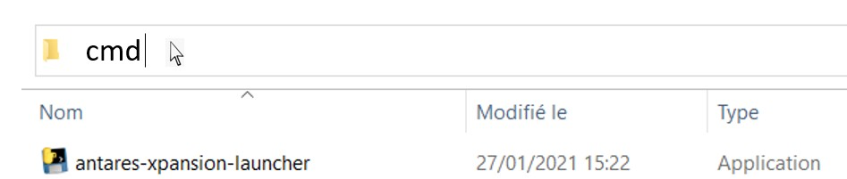
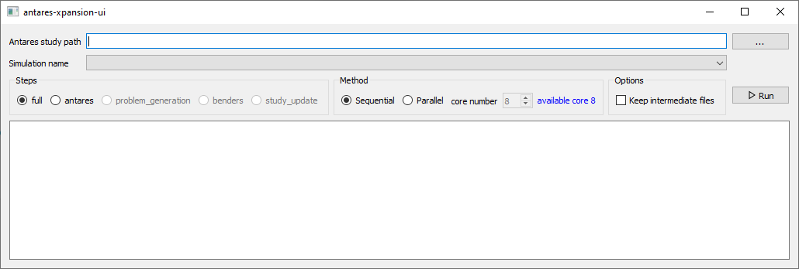
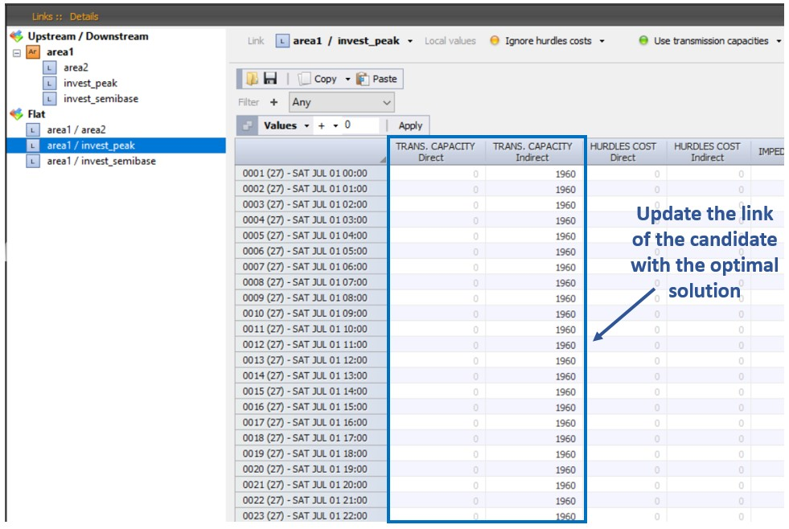

# Launching an optimization

First, create an ANTARES study with the description of the candidates
and create the candidates.ini and settings.ini files as explained above
and store them in the directory `study_path/user/expansion/`. Once the
`candidates.ini` and `settings.ini` files are set up, investment
optimization can be done with the package.

Antares-Xpansion include an experimental human-machine interface but it's optimatly used as a command line prompt. 
# Command line usages
1.  Open a Command Prompt in the `antaresXpansion-x.y.z-win64` folder

> Note:
> You can launch a command line prompt by typing `cmd` in the path
> 

2.  Run the `antares-xpansion-launcher.exe` and chose the path to the
    Antares study with `-i` parameter:

```cmd
antares-xpansion-launcher.exe -i .examples\SmallTestFiveCandidates
```
> `-i` parameter can also be replaced by `-–dataDir`

### Command line parameters
Here is a description of other available parameters.

#### **`--step`**

The python script does several operations one after the other. The
--step option allows to execute only one step or all steps
(interaction between the different bricks).

| step                 | Description                    |
| --------             | ------------------------------------------------------------------------ |
| `antares`            | Launch ANTARES one time to get the ANTARES problem
| `problem_generation` | Generate problem i.e launch getnamer one time to get the name of ANTARES variables and lpnamer one time to create the master problem of Antares-Xpansion       |
| `benders`            | Launch the resolution of Antares-Xpansion                                |
| `study_update`       | updates the study                            |
| `full`               | Launch all steps in order (antares \> getnames \> lp \> optim)           |

Default value: `full`.

#### **`-i` `--dataDir`**

Indicate the ANTARES simulation path. The specified path must be an
explicit path. Use quotes “” in case of a space in the path.

#### **`--simulationName`**

This option enables to give a name to an ANTARES simulation. In the case of step-by-step running default value is `last`. This value indicate last ANTARES simulation.

#### **`-m` `--method`**

This option enables to set the type of resolution to be used for
**Antares-Xpansion**

| Option | Description                           |
| ---------- | ----------------------------------------------------------------------- |
| sequential | Launch Benders sequential decomposition
| mpibenders | Launch the MPI version of the Benders decomposition if the user has MPI |
| mergeMPS   | Not implemented. Launch frontal resolution without decomposition        |

Defaut value: sequential

#### **--antares-n-cpu**
Number of Threads for Antares_Simulator
#### **`-v, --version`**
show **Antares-Xpansion** version.

#### **`--antares-version`**
show **Antares_Simulator** version.
# Human machine Interface usages
Since v0.6.0, AntaresXpansion came with an GUI in order to simplify AntaresXpansion utilization. For now this GUI is in the experimental phase. 
> 
# Results and logs

## Logs
During the simulation logs are displayed on the console to indicate current iteration :

```cmd
ITERATION 6:
    Solving master...
Time master solve pure = 0.026
    Master solved in 0.0296908 s
        Candidates:
                      battery = 1000.00 invested MW -- possible interval [0.00; 1000.00] MW
                         peak = 1300.00 invested MW -- possible interval [0.00; 2000.00] MW
                           pv = 1000.00 invested MW -- possible interval [0.00; 1000.00] MW
                     semibase =  200.00 invested MW -- possible interval [0.00; 2000.00] MW
            transmission_line =    0.00 invested MW -- possible interval [0.00; 3200.00] MW
    Solving subproblems...
    Subproblems solved in 0.159525 s
    Solution =
        Operational cost =    22525.07 Me
         Investment cost =      218.60 Me
            Overall cost =    22743.67 Me
           Best Solution =    22738.26 Me
             Lower Bound =    22738.20 Me
                     Gap = 5.40000e+04 e
ITERATION 7:
    Solving master...
Time master solve pure = 0.025
    Master solved in 0.0300845 s
        Candidates:
                      battery = 1000.00 invested MW -- possible interval [0.00; 1000.00] MW
                         peak = 1400.00 invested MW -- possible interval [0.00; 2000.00] MW
                           pv = 1000.00 invested MW -- possible interval [0.00; 1000.00] MW
                     semibase =  200.00 invested MW -- possible interval [0.00; 2000.00] MW
            transmission_line =    0.00 invested MW -- possible interval [0.00; 3200.00] MW
    Solving subproblems...
    Subproblems solved in 0.153621 s
        Solution =
            Operational cost =    22513.66 Me
             Investment cost =      224.60 Me
                Overall cost =    22738.26 Me
               Best Solution =    22738.26 Me
                 Lower Bound =    22738.26 Me
                         Gap = 3.05176e-05 e
--- CONVERGENCE outside optimitality gap :
    Best solution = it 5
     Overall cost = 22738.26 Me
Problem ran in 8.13665 s
Optimization results available in : C:\\antaresXpansion-x.y.z-win64\examples\SmallTestFiveCandidates\output\20210930-1056eco\lp\.\out.json
```

## Results
When the search for **Antares-Xpansion** ends, i.e. when the optimal
investment combination has been found or a stop criterion has been
reached - which can take several hours or even days in some cases - the
package:

  - Writes the outputs in the
    `reportbenderssequential` text file and in the `out.json` text file, which
    are in the ANTARES study `/output/simulation-name/lp/` folder. This
    report gives the parameters used in the `settings.ini` file for the
    **Antares-Xpansion** optimization, gives the capacities, the costs
    of the optimal solution and the time of resolution, as well as the
    path of the iterations of the Benders decomposition.

  - Updates the ANTARES study by replacing the capacities of investment
    candidate links with their optimal value taking into account the
    link-profile, the already-installed-capacity and the
    already-installed-link-profile:



**Figure** **15** – Example of update on the ANTARES study

The user can therefore relaunch the simulation corresponding to the last
iteration. However, it is recommended to relaunch a real ANTARES
post-**Antares-Xpansion** study for further analysis because
**Antares-Xpansion** relaxes certain constraints (see `link-profile` and
`uc_type` parameters) and the total costs could be a bit different.

## Errors

Xpansion will not work if the initial ANTARES study is not running. The
user must therefore check beforehand that the Antares simulations do not
contain any errors.

Be careful to check the consistency between the names of the
links in the candidates.ini file and in the Antares study and to use a
unique index and name per candidate.

In case of a problem, put an issue on Github:

<https://github.com/AntaresSimulatorTeam/antares-xpansion/>

