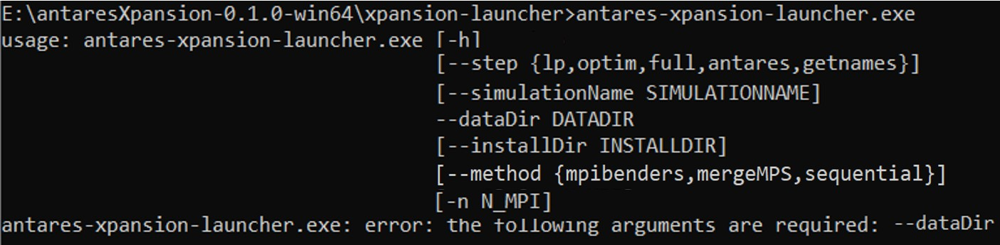
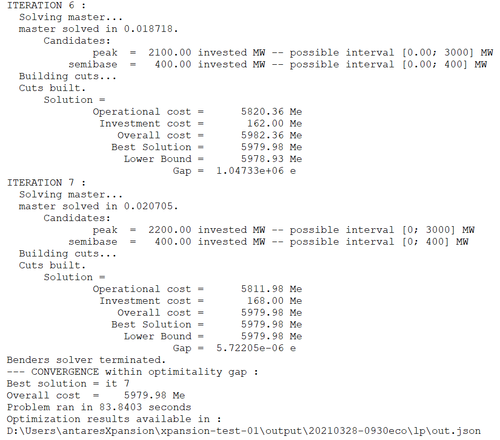

# Launching an optimization

First, create an ANTARES study with the description of the candidates
and create the candidates.ini and settings.ini files as explained above
and store them in the directory *study\_path/user/expansion/*. Once the
candidates.ini and settings.ini files are set up, investment
optimization can be done with the package.

Antares-Xpansion does not include a human-machine interface,
and it is used by a command line prompt:

1.  Open a Command Prompt in the `antaresXpansion-x.y.z-win64` folder:
    
    

2.  Run the `antares-xpansion-launcher.exe` and chose the path to the
    Antares study with `--dataDir` parameter:

  - antares-xpansion-launcher.exe --dataDir
    « D:\\Users\\franconmat\\Documents\\TP\\example\\xpansion-test-01 »

\* The *--dataDir* parameter can also be replaced by *–i.*

Other non-mandatory parameters other than *--dataDir* are available:
*--step , --method , --simulationName ,* *--installDir and –n* options.

**--step**

The python script does several operations one after the other. The
--step option allows to execute only one step or all the steps
(interaction between the different bricks).

| antares  | Launch ANTARES one time to get the ANTARES problem                       |
| -------- | ------------------------------------------------------------------------ |
| getnames | Launch getnamer one time to get the name of ANTARES variables            |
| lp       | Launch lpnamer one time to create the master problem of Antares-Xpansion |
| optim    | Launch the resolution of Antares-Xpansion                                |
| full     | Launch all steps in order (antares \> getnames \> lp \> optim)           |

Default value: full.

**--dataDir (-i)**

Indicate the ANTARES simulation path. The specified path must be an
explicit path. Use quotes “” in case of a space in the path.

**--simulationName**

This option enables to give a name to an ANTARES simulation. It is
necessary if you only run one of the following steps: getnames, lp,
optim without restarting the antares step.

**--method (-m)**

This option enables to set the type of resolution to be used for
**Antares-Xpansion**

| sequential | Launch Benders sequential decomposition                                 |
| ---------- | ----------------------------------------------------------------------- |
| mpibenders | Launch the MPI version of the Benders decomposition if the user has MPI |
| mergeMPS   | Not implemented. Launch frontal resolution without decomposition        |

Defaut value: sequential

**Results and logs**

When the search for **Antares-Xpansion** ends, i.e. when the optimal
investment combination has been found or a stop criterion has been
reached - which can take several hours or even days in some cases - the
package:

  - Writes the outputs in the
    benderssequential.log text file and in the out.json text file, which
    are in the ANTARES study /output/simulation-name/lp/ folder. This
    report gives the parameters used in the settings.ini file for the
    **Antares-Xpansion** optimization, gives the capacities, the costs
    of the optimal solution and the time of resolution, as well as the
    path of the iterations of the Benders decomposition. The results are
    also displayed in the command prompt:

  - Updates the ANTARES study by replacing the capacities of investment
    candidate links with their optimal value taking into account the
    link-profile, the already-installed-capacity and the
    already-installed-link-profile:

**Figure** **16** – Example of update on the ANTARES study

The user can therefore relaunch the simulation corresponding to the last
iteration. However, it is recommended to relaunch a real ANTARES
post-**Antares-Xpansion** study for further analysis because
**Antares-Xpansion** relaxes certain constraints (see link-profile and
uc\_type parameters) and the total costs could be a bit different.

**Errors**

Xpansion will not work if the initial ANTARES study is not running. The
user must therefore check beforehand that the Antares simulations do not
contain any errors.

Be careful to use the has-link-profile=True parameter in the case of a
use of link-profile, to check the consistency between the names of the
links in the candidates.ini file and in the Antares study and to use a
unique index and name per candidate.

Sometimes Xpansion needs to be restarted.

In case of a problem, put an issue on Github:

<https://github.com/AntaresSimulatorTeam/antares-xpansion/>

end of document
