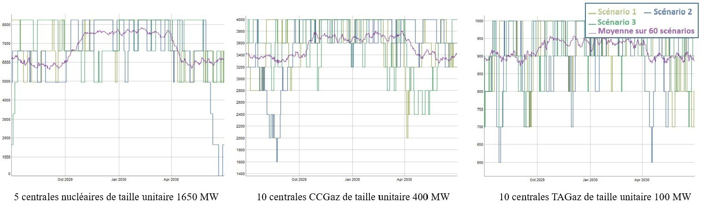

# The investment candidates in the Antares study

## Definition of investment candidates in the *candidates.ini* file

Not all links in the Antares study are by default investment candidates.
The user selects the investments candidates by specifying them in the
`candidates.ini` file. Each investment candidate is characterized
with the following properties:

- **`name`**: name of the investment candidate (:warning: must not
  contain spaces and unique)

- **`link`**: link whose capacity will be invested

- **`annual-cost-per-MW`**: investment cost, per year and per MW

- **`unit-size`**: size, in MW, of an investment unit (e.g., one group
  of 300 MW)

- **`maximum units`**: maximum number of units which can be built

### The `candidates.ini` file

The `candidates.ini` must be placed inside the Antares study folder  
`Antares-STUDY-FOLDER/user/expansion/candidates.ini`.
The format is a standard `.ini` and should follow this template:


**Figure 4** – Example of a candidates.ini file

Concretely, the investment decision will affect only the capacity of the
Antares' links. Investing in interconnections can be made directly with
the package, while investing in generation capacity or storage capacity
can be made using the so-called concept of "virtual nodes" with Antares.
The definition of all the investment candidates is given in a new input
file, located in the user folder of the study:
`./user/expansion/candidates.ini`.

The parameters that characterize the candidates are as follows:

#### `name` (mandatory parameter)

The value to be entered is a string. It specifies the name of the
investment applicant. Antares-Xpansion will use this name
in the output and the logs.

> :warning: This field must not contain spaces!

#### `link` (mandatory parameter)

The value to be entered is a string. It defines the link of the Antares
study candidate for investment, whose capacities (direct and indirect)
will be modified by Antares-Xpansion. The syntax of the link name
includes the names of the two Antares nodes that the link connects,
separated by "-", for example:
```
origin_area – destination_area
```

Note that node names that include spaces or dashes are not compatible
with Antares-Xpansion. The origin area corresponds to the first in
the spelling order. The same link may contain several investment
candidates (see section later).

#### `annual-cost-per-mw` (mandatory)

The value to be filled in is numeric (the decimal separator is the
point). It defines the investment candidate's fixed cost annuity (in
€/MW/year). Depending on the type of candidate (see section 2.3.3),
the fixed cost annuity can include:

- fixed operation and maintenance costs

- an investment cost annuity

#### `max-investment`

The value to be entered is numerical. It represents the candidate's
potential, i.e. the maximum capacity (in MW) that can be invested in
this candidate. If the candidate has this parameter, the set of values
that its capacity can take is the interval \\([0, \texttt{max-investment}]\\).

The definition of an investment candidate must necessarily include
either (i) a maximum potential in MW (`max-investment`) or (ii) a unit
size in MW (`unit-size`) and a maximum potential in number of units
(`max-units`).

#### `unit-size`

The value to be entered is numerical. It defines the nominal capacity
(in MW) of the investment candidate's installable units.

#### `max-units`

The value to be entered is an integer. It corresponds to the candidate's
potential in terms of number of installable units. If the candidate has
the `max-units` and `unit-size` parameters, then the set of values that its
capacity can take is the finite set of the first multiples of `unit-size`:

$$[0, \text{unit-size}, 2 \cdot \text{unit-size}, … , \text{max-units} \cdot \text{unit-size}]$$


#### `already-installed-capacity` {#already-installed-capa}

The value to be entered is numerical. It corresponds to a capacity
already installed on the investment candidate's link. If
Antares-Xpansion considers the investment in this investment
candidate to be economically relevant, the new capacity invested will be
added to the already installed capacity. The transmission capacities
initially indicated in the Antares study are not considered in the
`already-installed-capacity` parameter and will be overwritten by
Antares-Xpansion.


#### `link-profile`

The value to be filled is a string specifying the name of a file. This
file must be located in the `user/expansion/capa/` directory of the
Antares study. It must contain one or two columns of 8760 numerical
values (the decimal separator is the point). The `link-profile` makes the
link between the capacity invested and the capacity actually available,
in the direct and indirect directions of the Antares link for the 8760
hours of the year. The `link-profile` can for example be used to represent
the maintenance of a generation asset via a seasonalized power outage,
or the average load factor of intermittent renewable generation, defined
at hourly intervals. It should be noted that the `link-profile` is
deterministic: the same profile will be used by Antares-Xpansion for
all Monte-Carlo years of the Antares study and all capacity tested.


**Figure 5** – Example of a file containing a load factor profile in
the Antares-Xpansion format

#### `already-installed-link-profile`

The value to be filled is a string specifying the name of a file. This
file must be located in the `user/expansion/capa/` directory of the
Antares study and have the same format as a `link-profile` (see ***Figure
5***). The `already-installed-link-profile` makes the link between the
capacity invested and the hourly capacity actually available, in the
direct and indirect way of the Antares link for the 8760 hours of the
year. It should be noted that the same file can be used for `link-profile`
and `already-installed-link-profile` of one or more candidates.

### Examples of candidates

An example with two investments candidates, one in semi-base generation
and one in network capacity, is given below.


The invested semi-base generation in *area 1* is shifted in the "virtual
node" *`invest_semibase`*. Within the optimization process, the capacity
of the link between area 1 and *`invest_semibase`* will be updated with
the new invested capacity.

The candidates.ini file for this example will be the following one. This
file has to be saved in the folder `./user/expansion/`:

```ini
[1]
name = semibase
link = area1 - invest_semibase
annual-cost-per-mw = 126000
unit-size = 200
max-units = 5
already_installed_capacity = 200

[2]
name = grid
link = area1 - area2
annual-cost-per-mw = 3000
unit-size = 500
max-units = 4
```

Another example with solar generation in a virtual node:

```ini
[1]
name = solar_power
link = area1 - pv1
annual-cost-per-mw = 100000
max-investment = 10000
link-profile = pv1.txt
```
Where `pv1.txt` is a text file, located in the `./user/expansion/capa/`
folder of the study, and which contains the load factor time series of
the candidate (one column of 8760 values between 0 and 1, or two columns
if there is a direct and indirect profile on the link). When x MW of the
candidate *`solar_power`* will be invested, the actual time series of
available power will be equal to the product of x and the time series
pv1.txt.

### Link between invested capacity and capacity of the Antares study

The parameters `link-profile`, `already-installed-capacity` and
`already-installed-link-profile` are used to define the link between:

- the capacity installed by Antares-Xpansion, and

- the capacity actually available in the Antares study, hour by hour
  and in both directions of the link concerned.

- Note that these parameters are only useful if the candidates are
  grid reinforcement.


**Figure 6** – Link between the capacity invested by
Antares-Xpansion, and the capacity available in the Antares study

Note that by default, the parameters `link-profile` and
`already-installed-link-profile` contain only 1's, thus assuming "perfect"
availability of the invested capacity.

The parameter `link-profile` is conventionally used for:

- Take into account an NTC profile on an interconnection, possibly
  seasonalized and having a different impact on the direct and
  indirect directions of the link,

- Represent the maintenance of a thermal generation asset by
  considering a deterministic reduction of its power, possibly
  different according to the season (see **Figure 7**),

- Model renewable generation by multiplying the invested capacities by
  a (deterministic) load factor chronicle (e.g. an average chronicle
  or the chronicle of a given Monte-Carlo year).

The investment problem, at this stage of development, makes it possible
to manage the fact of investing in a capacity, whose availability varies
during the year with an average availability over all Monte-Carlo years
via the `link_profile`. However, it is not possible to manage an hourly
availability **per Monte-Carlo year**, which
would make it possible to represent more realistically the intermittency
of RES from one year to another or the impact of outages and maintenance
on an entire unit of thermal power plants (see **Figure 7**).



**Figure 7** Available hourly capacity of different types of power
plants due to outages. Antares-Xpansion allows taking into account
an average hourly availability (purple line) via the `link_profile`,
which is still very different from the actual hourly availability over a
year.

To validate the results, after having run the benders decomposition a
first time with a deterministic average hourly availability curve, it is
preferable to re-simulate these outages according to a stochastic
process by relaunching an Antares simulation with the capacities
obtained by antaresXpansion in order to obtain the real production
program with outages and RES intermittence varying according to the
scenarios.

## Several investment candidates on the same link

The same link in an Antares study can be the subject of several investment candidates. The interest of such an approach can be :

- to define several potentials with different fixed cost annuities

- to define several investment opportunities of different unit size.

The example in the following figure shows the case of an investment in photovoltaic production with three potentials of increasing cost.


**Figure 8** - Three potentials of increasing investment cost applying to the same link in the Antares study

Note that this only works with Benders if the costs are increasing and that investment candidates with the same link must also necessarily have the same `already-installed-capacity` and  `already-installed-link-profile`. 

## Investment Candidates and Decommissioning Candidates

The difference between _investment candidates_ and _decommissioning candidates_ is the fixed-cost-annuity.
For _investment candidates_ the cost function includes the investment cost (hence the fixed-cost-annuity).
For _decommissioning candidates_, there is no investment cost, since the investment *decision*
consists only on choosing whether to maintain operation with the associated maintenance costs:

### investment costs

The annuity of the _investment candidates_ includes the sum of:

  - fixed annual operation and maintenance costs

  - annualized investment costs

> In this configuration, Antares-Xpansion makes an economic choice
> between the sum of these costs and the reduction in variable operating
> costs (mainly fuel costs and penalties associated with loss of load)
> made possible by the new investment.

### decommissioning costs

The annuity for _decommissioning candidates_,
on the other hand, only includes the fixed annual
operation and maintenance costs. In this configuration,
Antares-Xpansion makes an economic choice between the operation
and maintenance costs of a generation or transmission asset, and the
savings it makes on the variable costs of power system operation.
The annualized investment costs are in this case considered as
stranded and are not taken into account in this economic choice. The
"potential" of this type of candidate (i.e. its max-investment or
max-units x `unit-size`) corresponds to its decommissionable capacity,
i.e. the candidate's already installed capacity that could be shut
down if it is no longer profitable for the power system.

Candidates for decommissioning should be explicitly specified in
Antares-Xpansion in the `name` (although this is not required by the tool).
Note that Antares-Xpansion is able to decommission neither the generation
units already installed in the Antares study, nor the capacities covered by the
`already-installed-capacity` parameter of the investment candidates.

By using the functionality presented in the last part, it is possible to
make on the same link:

- A candidate for decommissioning: defined by a capacity already
  installed and by its fixed operation and maintenance costs.

- A candidate for investment: defined by an expandable capacity and a
  fixed annuity of costs including investment costs.

An example of a production process that can be decommissioned or
expanded is given in the following figure.


**Figure 9** - Candidates for investment and decommissioning on
the same link from an Antares study*

!!! warning
    The hourly availability time series of thermal generation CCG
    in Antares should be higher than the sum of the availability currently
    installed with the new potential buildable  
    (availability of CCG cluster
    in the virtual node \\(fr_{ccg} > 330 \cdot 19 + 330 \cdot 50\\) with this example).

At the end, for the candidate for decommissioning, the result is inverse
than for the investment candidate: if the result displayed in the
console is: 300 x 19 MW invested, this means that
**no units are decommissioned**, if the
result displayed in the console is: 0 MW invested it means that
**all units have been decommissioned**.