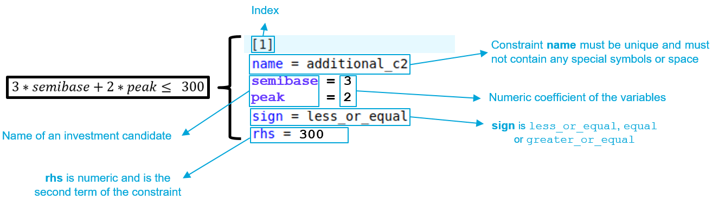

## Parameterization of the algorithm for solving the investment problem

The simulation options and algorithmic parameters for solving the
investment problem must be entered in `settings.ini` located in the
folder `user/expansion/` with the syntax given below:
```ini
uc_type = expansion_fast
master = integer
optimality_gap = 0
max_iteration = 100
additional-constraints = constraint.txt
```

This section lists the configurable parameters.
If the user does not specify the value of a parameter, its default value will be used.

### **`optimality_gap`**

Possible values: positive numeric values in euros (ex: `optimality_gap = 1e6`). Default
value: `1`.

The `optimality_gap` parameter, defined in euros, is the tolerance on the absolute gap for the
Antares-Xpansion algorithm. 

At each iteration, the algorithm computes upper and lower bounds on the optimal cost. The algorithm stops as soon as the quantity `best_upper_bound - best_lower_bound` falls below `optimality_gap`. The solution returned by the algorithm has a cost equal to `best_upper_bound`, which is guaranteed to be within `optimality_gap` euros of the optimal cost.

* If `optimality_gap = 0`, Antares-Xpansion will continue its
search until the optimal solution of the investment-optimization problem
is found. 
* If `optimality_gap > 0`, the search will stop
as soon as `best_upper_bound - best_lower_bound < optimality_gap`.


**Figure 10** – Illustration of the optimality gap and the set of
solutions that can be returned by the package when the gap is strictly
positive.

The interest of a strictly positive `optimality_gap` is that it speeds up
the search by stopping as soon as a "good" solution is found.

The interpretation of this stopping criterion is not always obvious. It
certainly guarantees that a solution found by the algorithm has a cost that is close
to the optimum, but it does not provide any information on the distance
(in MW) between the installed capacities of this solution and those of
the optimal solution: if the cost function is relatively flat
around the optimum, solutions whose costs are close may have
significantly different installed capacities (see for example **Figure
8**).

**Which settings should I use the** `optimality_gap`?

1. I have to run several expansion optimizations of different
  variants of a study and compare them. In that case, if the optimal
  solutions are not returned by the package, the comparison of several
  variants can be tricky. The imprecision of the method might indeed be of
  the same order of magnitude as the changes brought by the input
  variations. It is therefore advised to be as closed as possible from
  the optimum of the expansion problem. To do so, we advise to set the `optimality_gap` to zero.

2. I am building one consistent generation/transmission scenario. As
  the optimal solution is not more realistic than an approximate
  solution of the modelled expansion problem, the settings can be less
  constraining with an `optimality_gap` of a few million euros.

### **`relative_gap`**

Possible values: positive numeric values (ex: `relative_gap = 1e-6`). Default
value: `1e-12`.

The `relative_gap` parameter is the tolerance on the relative gap for the
Antares-Xpansion algorithm. 

At each iteration, the algorithm computes upper and lower bounds on the optimal cost. The algorithm stops as soon as the quantity `(best_upper_bound - best_lower_bound) / best_upper_bound` falls below `relative_gap`. For a relative gap \\(\alpha\\), the cost of the solution returned by the algorithm statisfies:

$$\frac{\texttt{xpansion\_solution\_cost}}{\texttt{optimal\_cost}} < \alpha .$$

!!! Remark
    The algorithm stops as soon as the first criterion among `optimality_gap` and `relative_gap` is met. Keep in mind that if either parameter is not specified by the user, the default value is used. 

### **`uc_type`** {#uc_type}

Possible values: `expansion_fast` and `expansion_accurate`. By default:
`expansion_fast`.

The `uc_type` (unit-commitment type) parameter specifies the simulation
mode used by Antares to evaluate the operating costs of the electrical
system:

- If `uc_type = expansion_fast`: the *fast* mode of Antares is used,
  deactivating the flexibility constraints of the thermal units (Pmin
  constraints and minimum up and down times), and not taking into
  account either the start-up costs or the impact of the day-ahead
  reserve.

- If `uc_type = expansion_accurate`: the *expansion* mode of Antares
  is used. This simulation mode corresponds to the *accurate* mode of
  Antares in which the unit-commitment variables are relaxed. The
  flexibility constraints of the thermal units as well as the start-up
  costs are taken into account.

### **`master`**

Possible values: `integer` and `relaxed`. By default: `integer`.

The master parameter provides information on how integer variables are
taken into account in the antaresXpansion master problem.

- If `master = relaxed`: the integer variables are relaxed, and the
  level constraints of the investment candidates (cf. max-units and
  `unit-size`) will not be necessarily respected.

- If `master = integer`: the problem of optimizing investments is solved
  by taking into account `unit-size` constraints of the candidates.

For problems with several investment candidates with large max-units,
using `master = relaxed` can accelerate the Antares-Xpansion algorithm
very significantly.

### **`max-iteration`**

Possible values: strictly positive integer or infinite. Default value:
Inf.

Benders decomposition stop criterion defined in maximum number of
iterations. Once this number of iterations is reached, the search for
Antares-Xpansion ends, regardless of the quality of the solution
found.


### **`yearly-weights`**

Value: string specifying the name of a file.

`yearly-weights` offers the possibility of assuming that the Monte Carlo
years simulated in the Antares study are not equally probable. The most
representative years may be given greater weight than those that are
less representative. The `yearly-weights` points to a vector
\\(\left( \omega_{1},\ldots,\omega_{n} \right)\\), with \\(n\\) the number
of Monte-Carlo years in the study, which is used to evaluate the
expected production costs. 

$$ \mathbb{E}\left(\text{cost}\right) = \frac{\sum_{i = 1}^{n}{\omega_i\text{cost}\_i}}{\sum\_{i = 1}^{n}\omega_{i}} $$

With \\(\text{cost}_{i}\\) the production cost of the \\(i\\)-th Monte Carlo
year.

The value to be filled is a string specifying the name of a file. This
file must be located in the `user/expansion/` folder of the Antares
study. It must contain a column with as many numerical values as there
are Monte-Carlo years in the Antares study. The value of the \\(i\\)-th
row is the weight of the \\(i\\)-th Monte Carlo year.


**Figure 11** – Example of a setting of Antares-Xpansion with
Monte-Carlo years that are not equally-weighted.

If the `yearly-weights` parameter is not used, the Monte-Carlo years of
the Antares study are considered to be equally-weighted.

The `yearly-weights` parameter **must be set in
line with the Antares study playlist by the user**: years with
zero weights must be removed from the Antares study playlist in order
not to be simulated unnecessarily.

### **`solver`**

Value: String specifying the name of a solver. Default value: Cbc.

To use another solver than Coin, you have to build the package with the chosen solver, please contact us. It’s not possible to put it on github for the moment.


### **`additional-constraints`**

Value: string specifying the name of a file.

The additional-constraint argument makes it possible to impose linear
constraints between the invested capacities of investment candidates.
The value of this parameter is the name of a file to be located in the
user/expansion/ folder of the Antares study. This file must be written
in a particular syntax and complements the master problem with new
linear constraints between investment candidates. The format is inspired
by Antares' binding constraints. An example of such a file is given in
the following figure:



**Figure 12** – Example of an additional constraint file

- `name`: the constraint name must be unique and must not contain any
  special symbols or space

- sign: direction of the equality: less\_or\_equal, equal or
  greater\_or\_equal

- rhs: numeric second term of the constraint

The user can also optionally use binary constraints to represent, for
example, exclusion constraints. In the following figure,
Antares-Xpansion cannot invest in semibase and peak at the same
time, it can also invest in neither:


**Figure 13** – Example of an additional constraint file

The use of binary variables is not recommended as it greatly increases
the calculation time.