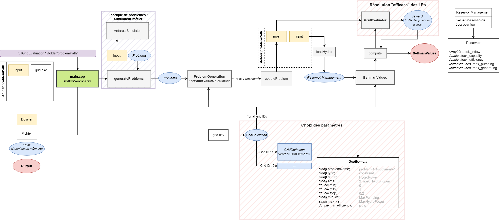

# Bellman values computation

The inputs for the computation of the Bellman values are:
- a study
- a grid defined by a grid.csv file at the root of the study

The outputs are the Bellman values for all the weeks discretized over 101 level of stock for all the grid IDs. The output is a json file named `[grid_ID]_bellman_values.json` located in the output directory.

## Input file grid.csv

Here is an example of a grid.csv file:
|grid_id,problem_name,type,name,area,min,max,step,min_cst,max_cst,min_efficiency|
|0|all|constraint|HydroPower|area|0|1|0.1|MaxPumping|MaxHydroPower|0.80|

with the following columns:
- `grid_id`: the ID of the grid
- `problem_name`: the name of the problem (`all` if all the problems are considered)
- `type`: the type of the constraint (`constraint` or `variable`)
- `name`: the name of the constraint or variable (`HydroPower` for Bellman values computation)
- `area`: the area to take into account
- `min`: the minimum value of the constraint or variable (from 0 to 1)
- `max`: the maximum value of the constraint or variable (from 0 to 1)
- `step`: the step of the discretization of the constraint or variable (from 0 to 1)
- `min_cst`: the name of the minimum constraint (`MaxPumping` for Bellman values computation)
- `max_cst`: the name of the maximum constraint (`MaxHydroPower` for Bellman values computation)
- `min_efficiency`: the minimum efficiency of the stock 

## Command line usage

### Quick start

1. Open a command prompt in your Antares-Xpansion install directory (by default it is named `antaresXpansion-x.y.z-win64` where `x.y.z` is the version number).
    You can launch a command line prompt by typing `cmd` in the path.

2. Run `bellman-values.exe` and choose the path to the Antares study with the `--study` parameter :
    ```
    bellman_values_exe --study data_test/one_node_base
    ```

### Command line parameters

#### `-h, --help`

Show a help message and exit.

#### `--study <path>`

Path to the Antares study.

#### `--solver {xpress, coin, clp, cbc}`

Default value: `xpress`.

#### `--threads <number>`

Default value: `1`.

Number of threads that will be used to solve the problems from the grid.

#### `--start-week <number>`

Default value: `1`.

Starting week of the Bellman values computation.

#### `--end-week <number>`

Default value: `52`.

Ending week of the Bellman values computation.

#### `--nb-levels <number>`

Default value: `10`.

Number of levels of the stock.

#### `--antares-format <bool>`

Default value: `false`.

If true, the output will be in the Antares format (values will be interpolated to get 101 levels of stock).

## Workflow

