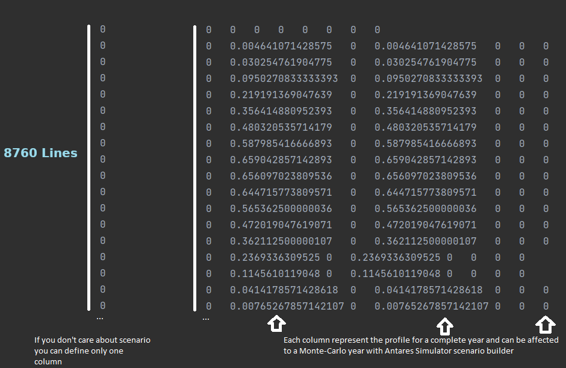
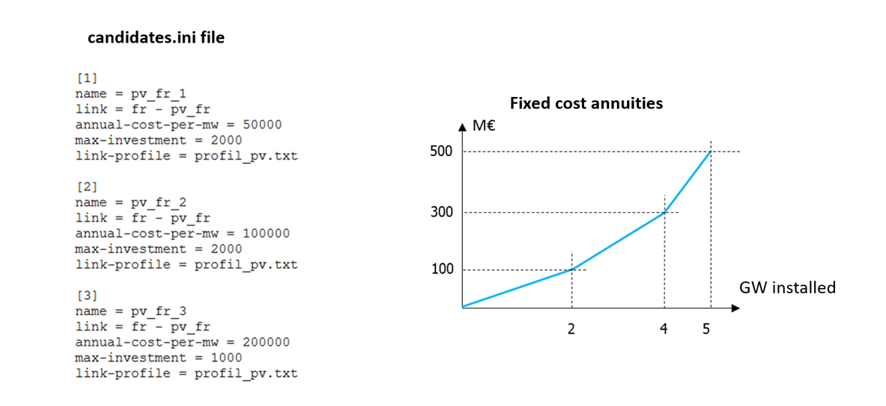

# Define the candidates

Once the Antares study has been prepared for the Antares-Xpansion simulation, by the introduction of virtual nodes as described in [Prepare the Antares study](prepare-a-simulation.md#prepare-the-antares-study), the user must use the `candidates.ini` file to characterize the investment candidates.

## Characterization of investment candidates in `candidates.ini`

Not all links in the Antares study are by default investment candidates.
The candidates are defined in the
`candidates.ini` file, which must be located inside the `user/expansion/` directory of the Antares study folder: `antares-study-folder/user/expansion/candidates.ini`. 

### Overview of the `candidates.ini` file

Each investment candidate is characterized
by the following properties:

- `name` (mandatory): name of the investment candidate (:warning: must not
  contain spaces and unique),

- `link` (mandatory): link on which there is a capacity investment,

- `annual-cost-per-mw` (mandatory): investment cost, per year and per MW,

- `unit-size`: size, in MW, of a single investment unit (e.g. one group
  of 300 MW),

- `max-units`: maximum number of units that can be built,

- `max-investment`: maximum capacity in MW that can be invested in the candidate,

- `already-installed-capacity`: capacity in MW that is
already installed on the investment candidate's link,

- `link-profile`: name of a file that links the invested capacity and the available capacity,

- `already-installed-link-profile`: name of a file that links the already installed capacity and the available capacity.

The format is a standard `.ini` and should follow this template:


**Figure 4** – Example of a candidates.ini file.

In Antares-Xpansion, the investment decisions only affect the capacity of the
Antares' links. Investment in physical generation capacity is done with virtual nodes as described in [Prepare the Antares study](prepare-a-simulation.md#prepare-the-antares-study).

### Details of the parameters

#### `name`

String, **mandatory**. Specifies the name of the
investment candidates. Antares-Xpansion uses this name
in the output and the logs.
  > :warning: This field must not contain spaces!
  
#### `link`

String, **mandatory**. Defines the link of the Antares
study candidate for investment, whose capacities (direct and indirect)
will be modified by Antares-Xpansion. The syntax of the link name
includes the names of the two Antares nodes that are connected by the link, separated by "-", for example:
```
origin_area – destination_area
```
Node names that include spaces or dashes are not compatible
with Antares-Xpansion. The origin area corresponds to the first in
the spelling order. The same link may contain several investment
candidates (see [this section](#several-investment-candidates-on-the-same-link )).

#### `annual-cost-per-mw`

Float, **mandatory**. The decimal separator is the
point. It defines the fixed cost annuity of the investment candidate (in
€/MW/year). Depending on the type of candidate,
the fixed cost annuity can include:

- Fixed operation and maintenance costs,
- An investment cost annuity.

#### `max-investment`

Float. Represents the candidate's
potential, i.e. the maximum capacity (in MW) that can be invested in
this candidate. If this parameter is set, the invested capacity can take any value in the interval \\( [0, \texttt{max-investment}]\\).

#### `unit-size`

Float. Defines the nominal capacity
(in MW) of the investment candidate's units.

#### `max-units`

Integer. Corresponds to the candidate's
potential in terms of number of installable units. If
the parameters `max-units` and `unit-size` are set, then the
invested capacity is necessarily a multiple of `unit-size` from the set:

$$
\\{0, \texttt{unit-size}, 2 \cdot \texttt{unit-size}, … , \texttt{max-units} \cdot \texttt{unit-size}\\}.
$$

!!! Warning 
    The definition of an investment candidate must necessarily include
    either (i) a maximum potential in MW (`max-investment`) or (ii) a unit
    size in MW (`unit-size`) and a maximum potential in number of units (`max-units`).

#### `already-installed-capacity`

Float. Corresponds to a capacity that is
already installed on the investment candidate's link. If
Antares-Xpansion finds that the investment in this
candidate is economically relevant, the new capacity will be added to the already installed capacity. The transmission capacities
initially indicated in the Antares study are not considered in the
`already-installed-capacity` parameter and are overwritten by
Antares-Xpansion.


#### `link-profile`

String, specifying the name of a file. This
file must be located in the `user/expansion/capa/` directory of the
Antares study. It must contain one or two columns of 8760 numerical
values (the decimal separator is the point), see **Figure 5**. The `link-profile` makes the
link between the invested capacity and the capacity that is actually available,
in the direct and indirect directions of the Antares link, for the 8760
hours of the year. More details are given in [this section](#link-between-invested-capacity-and-capacity-of-the-antares-study).

The `link-profile` can be used for example to represent
the maintenance of a generation asset via a seasonalized power outage,
or the average load factor of intermittent renewable generation, defined
at hourly intervals. 

!!! Remark 
    The `link-profile` is
    deterministic: the same profile is used by Antares-Xpansion for
    all Monte-Carlo years of the Antares study and all assessed capacities.



**Figure 5** – Example of a file containing a load factor profile in
the Antares-Xpansion format.

#### `already-installed-link-profile`

String, specifying the name of a file. This
file must be located in the `user/expansion/capa/` directory of the
Antares study and has the same format as a `link-profile` file, see **Figure 5**. The `already-installed-link-profile` makes the link between the
already installed capacity and the available capacity, in the
direct and indirect way of the Antares link, for the 8760 hours of the
year. More details are given in [this section](#link-between-invested-capacity-and-capacity-of-the-antares-study).


!!! Note 
    The same file can be used for `link-profile`
    and `already-installed-link-profile` of one or more candidates.

## Link between invested capacity and capacity of the Antares study

The parameters `link-profile`, `already-installed-capacity` and
`already-installed-link-profile` are used to define the link between the capacity installed by Antares-Xpansion, the already installed capacity and the truly available capacity in the Antares study, hour by hour and in both directions of the link, following the relationship presented in **Figure 6**.

These parameters are only useful if the candidates are grid reinforcement.


**Figure 6** – Link between the capacity invested by
Antares-Xpansion, and the capacity available in the Antares study.

By default, the `link-profile` and
`already-installed-link-profile` contain only 1's, thus assuming perfect
availability of the invested capacity.

The parameters `link-profile` and `already-installed-link-profile` are conventionally used to:

- Take into account an NTC profile on an interconnection, possibly
  seasonalized and having a different impact on the direct and
  indirect directions of the link,

- Represent the maintenance of a thermal generation asset by
  considering a deterministic reduction of its power, possibly
  different according to the season (see **Figure 7**),

- Model renewable generation by multiplying the invested capacities by
  a (deterministic) load factor chronicle (e.g. an average chronicle
  or the chronicle of a given Monte-Carlo year).

!!! Remark
    The investment problem, at this stage of development, allows
    to manage, via the `link_profile`, the fact that the availability of an invested capacity varies
    during the year with an average availability over all Monte-Carlo years. However, it is not possible to manage an hourly
    availability **per Monte-Carlo year**, which
    would make it possible to represent more realistically the intermittency
    of RES from one year to another or the impact of outages and maintenance
    on an entire unit of thermal power plants (see **Figure 7**).


**Figure 7** – Available hourly capacity of different types of power
plants due to outages. Antares-Xpansion allows taking into account
an average hourly availability (purple line) via the `link_profile`,
which is still very different from the actual hourly availability over a
year.

To validate the results, after running the Antares-Xpansion algorithm a
first time with a deterministic average hourly availability curve, it is
preferable to re-simulate these outages according to a stochastic
process by relaunching an Antares simulation with the capacities
obtained by Antares-Xpansion in order to obtain the real production
program with outages and RES intermittence varying according to the
scenarios.

## Examples of candidates

### Basic example

An example with two investments candidates, one in semi-base generation
and one in network capacity, is given below.


The invested semi-base generation in `area1` is shifted in the virtual
node `invest_semibase`. During the optimization process, the capacity
of the link between `area1` and `invest_semibase` will be updated with
the new invested capacity.

The `candidates.ini` file for this example is the following one:

```ini
[1]
name = semibase
link = area1 - invest_semibase
annual-cost-per-mw = 126000
unit-size = 200
max-units = 5
already_installed_capacity = 200

[2]
name = grid
link = area1 - area2
annual-cost-per-mw = 3000
unit-size = 500
max-units = 4
```

Another example with solar generation in a virtual node:

```ini
[1]
name = solar_power
link = area1 - pv1
annual-cost-per-mw = 100000
max-investment = 10000
link-profile = pv1.txt
```
where `pv1.txt` is a text file, located in the `user/expansion/capa/`
folder of the study, and which contains the load factor time series of
the candidate, see **Figure 5**. When \\(x\\) MW of the
candidate `solar_power` are invested, the actual time series of
available power is equal to the product of \\(x\\) and the time series `pv1.txt`.

### Several investment candidates on the same link

The same link in an Antares study can be the support of several investment candidates. The interest of such an approach can be :

- To define several potentials with different fixed cost annuities,

- To define several investment opportunities of different unit size.

The example in **Figure 8** shows the case of an investment in photovoltaic production with three potentials of increasing cost.


**Figure 8** – Three potentials of increasing investment cost that applies to the same link in the Antares study.

This only works with the Antares-Xpansion algorithm (Benders decomposition) if the costs are increasing and if the investment candidates with the same link have the same `already-installed-capacity` and  `already-installed-link-profile`. 

### Decommissioning candidates

In this example, we show how to consider both an investment candidate and a decommissioning candidate on the same link. Candidates for decommissioning must be moved from their physical location to a virtual node as explained in [Prepare the Antares study](prepare-a-simulation.md#decommissioning-decisions-for-thermal-capacities).

We strongly advise to explicitly specify candidates for decommissioning in the `name` field of the `candidates.ini` file (although this is not required by the tool), see **Figure 9**. This will ease the analysis of Antares-Xpansion output for the user.

By considering [several investment candidates on the same link](#several-investment-candidates-on-the-same-link ), it is possible to model both an investment and a decommissioning candidate.

- The candidate for decommissioning is defined by:

    - A decommissionable capacity, that corresponds to a `max-investment` or `max-units` \\( \times\\) `unit-size`.
    - Fixed operation and maintenance costs (no investment cost) given in the field `annual-cost-per-mw`.

- The candidate for investment is defined as by:

    - An expandable capacity, that corresponds to a `max-investment` or `max-units` \\( \times\\) `unit-size`.
    - A fixed-cost annuity that includes investment costs and fixed operation and maintenance costs given in the field `annual-cost-per-mw`.

An example of production process that can be decommissioned or
expanded is given in **Figure 9**.


**Figure 9** – Candidates for investment and decommissioning on
the same link from an Antares study.

!!! warning
    The hourly availability time series of thermal generation CCG
    in Antares should be higher than the sum of currently
    installed and new potential buildable capacities
    (availability of CCG cluster
    in the virtual node \\(fr_{ccg} > 330 \cdot 19 + 330 \cdot 50\\) in this example).

!!! Remark
    If the user specifies an `already-installed-capacity` for the decommissioning candidate, this capacity will **not** be decommissioned by Antares-Xpansion.

From the modelling of _decommissioning candidates_, it follows that the final result should be read "in the opposite way" compared to _investment candidates_: 

  - If the result displayed in the console for `fr_ccg_decommissioning` is 300 x 19 MW invested, this means that **no unit is decommissioned**. 
  - If the result displayed in the console for `fr_ccg_decommissioning` is 0 MW invested, this means that **all units have been decommissioned**.