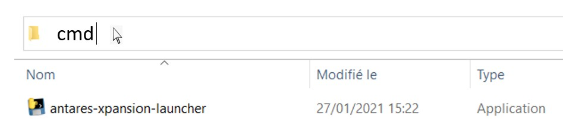

# Launch the optimization

Once you have [set up your Antares study](prepare-a-simulation.md) with the `candidates.ini` and `settings.ini` files, you are ready to launch the Antares-Xpansion package to solve the investment problem.

Antares-Xpansion includes an experimental graphical interface but it is optimally used as a command line prompt. 
## Command line usage

### Quick start

1.  Open a command prompt in your Antares-Xpansion install directory (by default it is named `antaresXpansion-x.y.z-win64`
where `x.y.z` is the version number). 

	You can launch a command line prompt by typing `cmd` in the path.

	

2.  Run `antares-xpansion-launcher.exe` and choose the path to the
    Antares study with the `-i` parameter:
    ```
    antares-xpansion-launcher.exe -i examples\SmallTestFiveCandidates
    ```
> The `-i` parameter can also be replaced by `--dataDir`.

### Command line parameters

#### `-h, --help`

Show a help message and exit.

#### `--step {full, antares, problem_generation, benders, study_update, sensitivity}`

Default value: `full`. 

The execution of Antares-Xpansion consists of several steps that can be run separately. The
`--step` parameter allows to select the steps to execute:

| Step                 | Description                    |
| :--------            | ------------------------------------------------------------------------ |
| `antares`            | Launch Antares-Simulator once to get the Antares problem.
| `problem_generation` | Generate the full Antares-Xpansion problem using the user input and the output of the Antares-Simulator run. |
| `benders`            | Solve the investment optimization problem of Antares-Xpansion, using the [Benders decomposition](../optimization-principles/investment-problem.md).|
| `study_update`       | Update the Antares study with the solution returned by the [Benders decomposition](../optimization-principles/investment-problem.md) algorithm. |
| `full`               | Launch all steps in order: `antares` \> `problem_generation` \> `benders` \> `study_update`           |
| `sensitivity`        | Launch sensitivity analysis, see [Sensitivity analysis](sensitivity-analysis.md).                       |

#### `-i, --dataDir`

Specifies the Antares study folder path. Use quotes `“antares study path”` in case of a space in the path.

#### `--simulationName {last, your-antares-output-directory}`

Default value: `last`. 

Defines the name of the Antares-Simulator output directory that Antares-Xpansion uses to generate the expansion problem. If the value is `last`, the most recent run will be used. This option only has an effect when `--step` is among `{problem_generation, benders, study_update}`.

#### `-m, --method {sequential, mpibenders, mergeMPS}`

Default value: `sequential`. 

Sets the optimization method used by Antares-Xpansion.

| Option | Description                           |
| ---------- | ----------------------------------------------------------------------- |
| `sequential` | Launch sequential Benders decomposition.
| `mpibenders` | Launch the MPI version of Benders decomposition if the user has MPI. Use the option `-n` or `--np` to set the number of processes to use.  |
| `mergeMPS`   | Launch a frontal resolution of the investment problem (i.e. without decomposition). This is much more time-consuming than using Benders decomposition.|

#### `-n, --np`

Default value: 2. 

Sets the number of MPI processes to use for the MPI version of Benders decomposition. This option only has an effect when `-m` is set to `mpibenders`.

#### `--antares-n-cpu`

Default value: 1.

Sets the number of threads to use for Antares-Simulator in the initial `antares` step.

#### `--keepMps`

Default value: `False`.

If set to `True`, keeps `mps` files that encodes the problems solved by the optimizer. This option must be set to `True` if the user intends to launch the optimization several times on the same study (`--step benders`) without doing the other steps of Antares-Xpansion.
#### `-v, --version`

Show the Antares-Xpansion version.

#### `--antares-version`

Show the Antares-Simulator version (used in the `antares` step).

## Graphical user interface

Since v0.6.0, Antares-Xpansion comes with a GUI. The GUI can be launched by running `antares-xpansion-ui.exe`. For now, this GUI is in the experimental phase. 


## Output of Antares-Xpansion

### Results
When the Antares-Xpansion algorithm terminates, i.e. when an optimal
investment combination has been found, the
package performs the following steps:

  - It writes output data in the `reportbenderssequential` text file and the `out.json` file located in the subdirectory `/output/simulation-name/lp/` of the Antares study. They gather for each iteration:
	1. The investment combination that has been evaluated,
	2. The operational, investment and overall costs, 
	3. The current lower and upper bounds,
	4. The absolute and relative gap,  
	5. The resolution time for the subproblems (`reportbenderssequential` only) and the master problem.

	Finally, the iteration number which has led to the best solution is given. The file `out.json` also gives the parameters that are used by the optimization algorithm (some of them are defined by the user in `settings.ini`).   

  - It updates the Antares study by replacing the capacities of investment
    candidate links with their optimal value taking into account the
    `link-profile`, the `already-installed-capacity` and the
    `already-installed-link-profile`, see **Figure 15**.
	
	The user can therefore immediately launch an Antares simulation using the results of the best iteration. 
	
	!!! Advice 
		It is recommended to relaunch an Antares study with the optimal solution returned by Antares-Xpansion for further analysis. Antares-Xpansion relaxes some constraints (see `link-profile` and `uc_type` parameters for example), therefore the total cost may be a bit different.


**Figure** **15** – Update of the Antares study.

### Logs
During the simulation, logs are displayed on the console to give information on the current iteration, corresponding to the data written in the `reportbenderssequential` text file.

```
ITERATION 6:
	Solving master...
Time master solve pure = 27.202
	Master solved in 0.0329394 s
		Candidates:
			          battery = 1000.00 invested MW -- possible interval [0.00; 1000.00] MW
			             peak = 1300.00 invested MW -- possible interval [0.00; 2000.00] MW
			               pv = 1000.00 invested MW -- possible interval [0.00; 1000.00] MW
			         semibase =  200.00 invested MW -- possible interval [0.00; 2000.00] MW
			transmission_line =    0.00 invested MW -- possible interval [0.00; 3200.00] MW
	Solving subproblems...
	Subproblems solved in 0.165742 s
		Solution =
			Operational cost =    22525.07 Me
			 Investment cost =      218.60 Me
			    Overall cost =    22743.67 Me
			   Best Solution =    22738.26 Me
			     Lower Bound =    22738.20 Me
			    Absolute gap = 5.40000e+04 e
			    Relative gap = 2.37485e-06
ITERATION 7:
	Solving master...
Time master solve pure = 30.593
	Master solved in 0.0365323 s
		Candidates:
			          battery = 1000.00 invested MW -- possible interval [0.00; 1000.00] MW
			             peak = 1400.00 invested MW -- possible interval [0.00; 2000.00] MW
			               pv = 1000.00 invested MW -- possible interval [0.00; 1000.00] MW
			         semibase =  200.00 invested MW -- possible interval [0.00; 2000.00] MW
			transmission_line =    0.00 invested MW -- possible interval [0.00; 3200.00] MW
	Solving subproblems...
	Subproblems solved in 0.168702 s
		Solution =
			Operational cost =    22513.66 Me
			 Investment cost =      224.60 Me
			    Overall cost =    22738.26 Me
			   Best Solution =    22738.26 Me
			     Lower Bound =    22738.26 Me
			    Absolute gap = 3.05176e-05 e
			    Relative gap = 1.34212e-15
--- Run completed: absolute gap reached
	Best solution = it 5
	 Overall cost = 22738.26 Me
Problem ran in 7.93209 s
Optimization results available in : C:\\antaresXpansion-x.y.z-win64\examples\SmallTestFiveCandidates\output\20211126-1755eco\lp\.\out.json
-- Study Update
```

## Errors

Xpansion will not work if the initial Antares study is not running. The
user must therefore check beforehand that the Antares simulations do not
contain any errors.

Be careful to check the consistency between the names of the
links in the `candidates.ini` file and in the Antares study and to use a
unique index and name per candidate.

In case of a problem, put an issue on Github:

<https://github.com/AntaresSimulatorTeam/antares-xpansion/>

