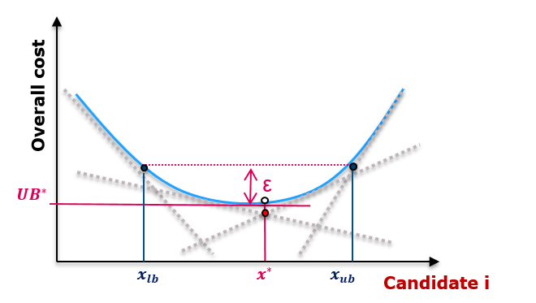

# Sensitivity analysis

Antares-Xpansion solves an investment problem and returns the optimal combination of invested capacities. Then, it may be worth to assess the robustness of the optimal solution by looking at near optimal solutions, see **Figure 16**. 

We call \\(\varepsilon\\)-optimal solution a combination of investments that is within \\(\varepsilon\\) euros of the optimal cost. The interest of knowing the set of \\(\varepsilon\\)-optimal solutions is the following:

- Suppose that there exists an \\(\varepsilon\\)-optimal solution for which the invested capactities are very different from the optimal solution. This means that the optimal solution is not stable with respect to these capacities. The cost difference between technologies does not allow to clearly distinguish these solutions.

- On the other hand, if all \\(\varepsilon\\)-optimal solutions have almost the same invested capacities, then the solution is robust and the cost-effectiveness of the investment is ensured.



**Figure 16** - Example of \\(\varepsilon\\)-optimal solutions. There exist solutions with invested capacities in the range \\([x_{lb}, x_{ub}]\\) that have an overall cost within \\( \varepsilon \\) euros of the optimal cost \\( UB^{*} \\).

The sensitivity analysis module of Anatres-Xpansion is able to perform the following computation:

- It determines the min and max capacity of a given candidate for which there exists an \\(\varepsilon\\)-optimal solution. The associated \\(\varepsilon\\)-optimal solution is also returned. This allows to define, for each candidate, the interval within which all \\(\varepsilon\\)-optimal solutions can be found.
- It computes the \\(\varepsilon\\)-optimal solution that minimizes or maximizes the investment cost (CAPEX).

## Description of the method

The sensitivity analysis computation is based on the last master problem used during the Benders algorithm. The Benders cuts of the last master problem (dotted grey lines in **Figure 16**) define a piecewise approximation of the cost function (in blue, that is unknown).

The user sets a threshold \\(\varepsilon\\) up to which investment solutions are considered _near optimal_ or _equivalent_. The sensitivity analysis is an exploration, in a given _direction_, of the set of solutions that are within \\(\varepsilon\\) euros of the optimal cost (i.e. the best upper bound of the Benders algorithm).

**Figure 16** illustrates the case where we look at the range of invested capacity of candidate \\(i\\) for which there exists at least one \\(\varepsilon\\)-optimal solution. We can then define a capacity interval \\([x_{lb}, x_{ub}]\\) for candidate \\(i\\) which is the projection of the set of \\(\epsilon\\)-optimal solutions on the dimension of the capacity of this candidate.

!!! Remark
    As we only known a lower approximation of the real cost function (see **Figure 16**), the width of the capacity interval given by the sensitivity analysis may be overestimated.

The capacity intervals of all candidates define a _hyperrectangle_ that is (often strictly) larger than the set of \\(\varepsilon\\)-optimal solutions.

!!! Warning
    There may be some solutions within the hyperrectangle that are **not \\(\varepsilon\\)-optimal**. For example, the solution where all capacities are taken to be the lower bound of the candidate interval is not necessarily \\(\varepsilon\\)-optimal. However, for each bound of each candidate interval, the sensitivity analysis module returns an \\(\varepsilon\\)-optimal solution where this bound is reached.

It is also possible to find the \\(\varepsilon\\)-optimal solution that minimizes or maximizes the CAPEX. This is just another _direction_ of exploration of the set of \\(\varepsilon\\)-optimal solutions.


## Mathematical formulation of the sensitivity analysis problem

Let us recall the formulation of the master problem:

$$
\begin{aligned}
    \min\_{x \in \mathcal{X}}\ & c^{\top}x + \frac{1}{N} \sum_{l=1}^{N} \sum_{s=1}^{52} p_{l, s}\vartheta_{l, s} \\\\
    \text{s.t.} \ & Ax = b\\\\
    & \vartheta_{l, s} \geq {{}\bar{\pi}\_{l, s}^{i}}^{\top} (d_{l, s} - T_{s}x)\ , \quad \forall l \ , \forall s \ , \forall i
\end{aligned}
$$

where the constraints \\( \vartheta_{l, s} \geq {{}\bar{\pi}\_{l, s}^{i}}^{\top} (d_{l, s} - T_{s}x) \\) are the Benders cuts. More details can be found in [Mathematical formulation of the investment problem](../optimization-principles/problem-formalization.md).

The sensitivity analysis problem is then of the form:

$$
\begin{aligned}
    \min\_{x \in \mathcal{X}}\ & \tilde{c}^{\top}x \\\\
    \text{s.t.} \ & Ax = b\\\\
    & \vartheta_{l, s} \geq {{}\bar{\pi}\_{l, s}^{i}}^{\top} (d_{l, s} - T_{s}x)\ , \quad \forall l \ , \forall s \ , \forall i \\\\
    & c^{\top}x + \frac{1}{N} \sum_{l=1}^{N} \sum_{s=1}^{52} p_{l, s}\vartheta_{l, s} \leq UB^{*} + \varepsilon
\end{aligned}
$$

where the last constraint means that we are looking only for solutions within \\(\varepsilon\\) euros of the optimal solution. The vector \\(\tilde{c}\\) defines the _direction_ in which we explore the set of \\(\varepsilon\\)-optimal solutions:

- With \\(\tilde{c} = (0,\ldots,0,1,0,\ldots,0)\\) where the \\(1\\) is in the \\(i\\)-th position, the sensitivity problem objective is to minimize \\(x_{i}\\): we aim at finding the \\(\varepsilon\\)-optimal solution with the least installed capacity for candidate \\(i\\).
- With \\(\tilde{c} =c\\), the sensitivity problem objective is \\(c^{\top}x\\), which is exactly the CAPEX: we aim at finding the \\(\varepsilon\\)-optimal solution with the minimum investment cost.

The sensitivity problem is also solved as a maximization problem to find \\(\varepsilon\\)-optimal solutions with the maximum installed capacity for some candidate or the maximum CAPEX.

## Results interpretation

Suppose that for candidate \\(i\\), the one-dimensional projection of \\(\varepsilon\\)-optimal solutions is the interval \\([x_{lb}, x_{ub}]\\).

- The lower bound \\(x_{lb}\\) is the minimum installed capacity of candidate \\(i\\) found in **every** \\(\varepsilon\\)-optimal solution. This means that for an investment up to \\(x\_{lb}\\), profitability is ensured.

- The upper bound \\(x_{ub}\\) is the maximum installed capacity of candidate \\(i\\) found in the set of \\(\varepsilon\\)-optimal solutions.

The width of the interval gives information on the robustness of the solution:

- If the interval \\([x\_{lb}, x_{ub}]\\) is tight, this means that all _equivalent_ solutions have almost the same installed capacity of candidate \\(i\\). The optimal solution is _stable_ for this candidate, therefore the investment is profitable and robust to small variations of the overall cost.

- If the interval is large, the cost function is flat near the optimum in the direction of candidate \\(i\\). The economic criterion alone is not sufficient to choose a capacity value over another. 

## Launch the sensitivity analysis

### Sensitivity input file creation

In order to run the sensitivity analysis, the user must create a JSON file named `sensitivity_in.json` that is stored in the `user/expansion/senstivity` directory of the Antares study.

```
antares-study
└─── input
└─── layers
└─── logs
└─── output
└─── settings
└─── user
│   └───expansion
│       │   candidates.ini
│       │   settings.ini
│       │   ...
|       └───sensitivity
|           | sensitivity_in.json
```
**Figure 17** - Structure of an Antares study folder ready for a sensitivity analysis.

The file `sensitivity_in.json` contains 3 fields:

- `epsilon` (float) : Defines the maximum gap with the optimal solution that is allowed.
- `capex` (bool) : If `true`, the CAPEX sensitivity problems are solved (minimization and maximization), otherwise they are not solved.
- `projection` (list of strings) : List of candidate names for which the projection of the set of \\(\varepsilon\\)-optimal solutions is computed. For each candidate, two problems are solved: minimization and maximization of the invested capacity.

An sample `sensitivity_in.json` is given below:
```json
{
    "epsilon" : 1e4,
    "capex": false,
    "projection": ["peak", "semibase"]
}
```

### Run the sensitivity analysis

The sensitivity analysis can be launched from the command line as follows:

```
antares-xpansion-launcher.exe -i examples\SmallTestFiveCandidates --step sensitivity  --simulationName mySimulation.zip
```

- The `-i` parameter specifies the Antares study folder path.
- The `--step` parameter specifies that we launch a sensitivity analysis.
- The `--simulationName` parameter (optional) is the name of the Antares-Xpansion output archive on which we wish to
  perform the sensitivity analysis. If `--simulationName` is not specified, the most recently modified output of the
  Antares study folder will be used. The output used by the sensitivity analysis **must contain the results of an
  Antares-Xpansion optimization**.

The problems solved during the sensitivity analysis use the same solver settings and integrality constraints on the candidates as those used beforehand to perform the corresponding Antares-Xpansion optimization.

### Output of the sensitivity analysis

The sensitivity analysis module creates a JSON file `sensitvity_out.json` that is stored in the directory `output/simulation-name/sensitivity` of the Antares study folder.

A sample output file is given below:
```json
{
	"antares" : 
	{
		"version" : "8.1.0"
	},
	"antares_xpansion" : 
	{
		"version" : "0.6.0"
	},
	"best benders cost" : 178836183.38241878,
	"epsilon" : 10000,
	"sensitivity solutions" : 
	[
		{
			"candidates" : 
			[
				{
					"invest" : 948.01436354994814,
					"name" : "peak"
				},
				{
					"invest" : 0,
					"name" : "semibase"
				}
			],
			"objective" : 56880861.812996887,
			"optimization direction" : "min",
			"problem type" : "capex",
			"status" : 0,
			"system cost" : 178846183.38241878
		},
		{
			"candidates" : 
			[
				{
					"invest" : 1201.3053164764756,
					"name" : "peak"
				},
				{
					"invest" : 400,
					"name" : "semibase"
				}
			],
			"objective" : 108078318.98858854,
			"optimization direction" : "max",
			"problem type" : "capex",
			"status" : 0,
			"system cost" : 178846183.38241878
		},
		{
			"candidates" : 
			[
				{
					"invest" : 584.99719014093932,
					"name" : "peak"
				},
				{
					"invest" : 400,
					"name" : "semibase"
				}
			],
			"objective" : 584.99719014093932,
			"optimization direction" : "min",
			"problem type" : "projection peak",
			"status" : 0,
			"system cost" : 178846183.38241875
		},
		{
			"candidates" : 
			[
				{
					"invest" : 1759.8724009014643,
					"name" : "peak"
				},
				{
					"invest" : 0,
					"name" : "semibase"
				}
			],
			"objective" : 1759.8724009014643,
			"optimization direction" : "max",
			"problem type" : "projection peak",
			"status" : 0,
			"system cost" : 178846183.38241875
		},
	]
}
```

In this example, we have performed the sensitivity analysis with the following input file:
```json
{
    "epsilon" : 1e4,
    "capex": false,
    "projection": ["peak"]
}
```

The output file gathers the following data:

- The version of Antares and Antares-Xpansion that is used,
- `best benders cost`: Best upper bound, that is the optimal overall cost, found in the Antares-Xpansion optimization that was executed beforehand,
- `epsilon`: Maximum gap with the optimal solution that is allowed,
- `sensitivity solutions`: An array containing data for each sensitivity problem that is solved:

    - `objective`: Value of the objective of the sensitivity problem:
    
        - For a CAPEX minimization (resp. maximization) problem, this the value of the mimimum (resp. maximum) CAPEX that is found over the \\(\varepsilon\\)-optimal solutions. 
        - For the minimization (resp. maximization) projection problem of candidate \\(i\\), this is the minimum (resp. maximum) invested capacity of candidate \\(i\\) over the \\(\varepsilon\\)-optimal solutions.
    
    - `optimization direction`: The direction of the sensitivity problem i.e. minimization or maximization,
    - `problem type`: The type of sensitivity problem that is solved,
    - `status`: Optimization status

        - 0: optimal,
        - 1: infeasible,
        - 2: unbounded.

    - `candidates` : An array describing an \\(\varepsilon\\)-optimal investment combination that satisfies the bound found in the sensitivity problem:
        - For a CAPEX minimization (resp. maximization) problem, this is an \\(\varepsilon\\)-optimal investment combination that minimizes (resp. maximizes) the CAPEX.
        - For the minimization (resp. maximization) projection problem of candidate \\(i\\), this is an \\(\varepsilon\\)-optimal investment combination that minimizes (resp. maximizes) the capacity of candidate \\(i\\).

    - `system cost`: Value of the overall system cost obtained with the investment combination given in `candidates`.

!!! Remarks
    - For the projection problem on candidate \\(i\\), we logically retrieve that the `objective` is equal to the invested capacity in candiate \\(i\\) from the `candidates` section.
    - For all sensitivity problems, we must have `system cost <= best benders cost + epsilon` as this is the constraint that is enforced. As the solutions of a linear program are on the boundary of the domain, it is often the case (but not always) that this constraint is saturated for the sensitivity solutions, so that we have `system cost = best benders cost + epsilon`.
    
