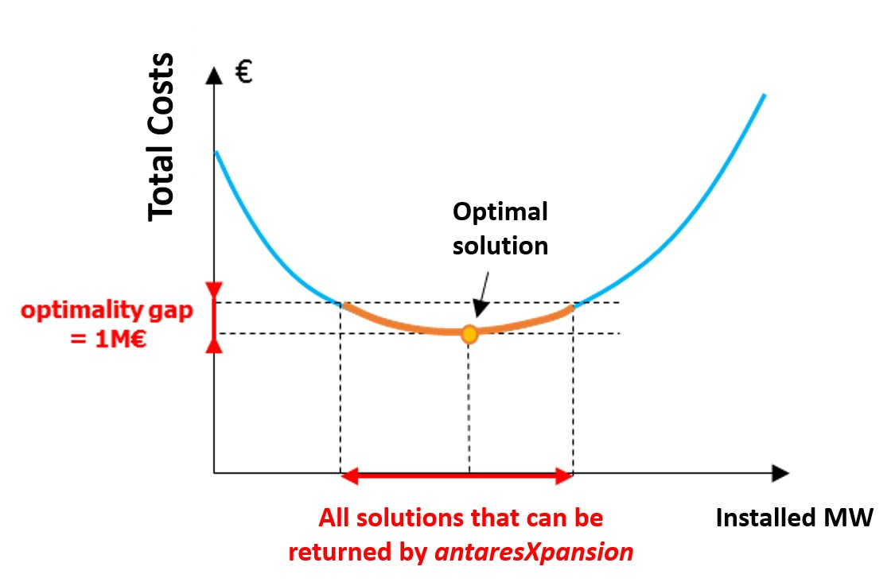
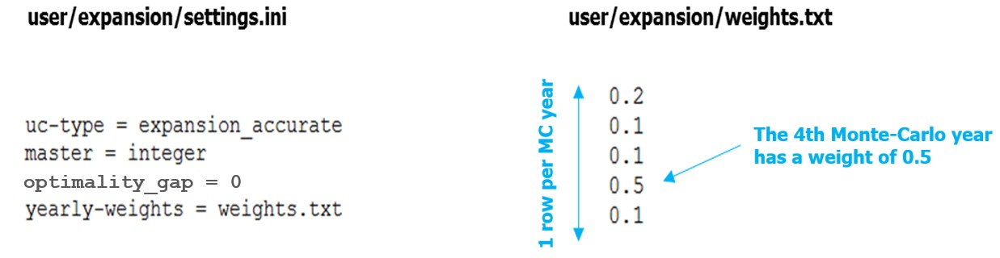
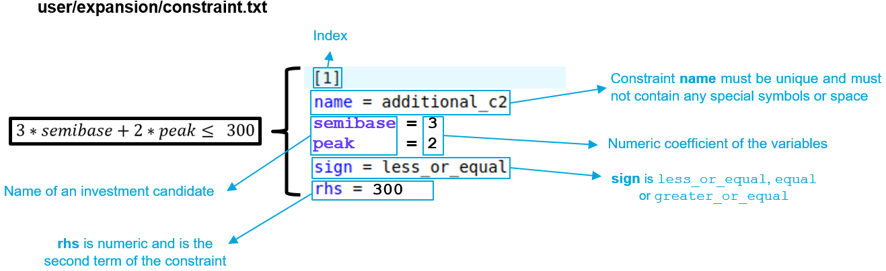
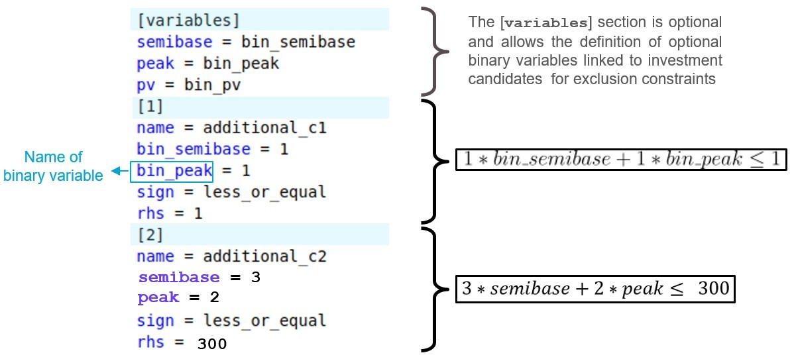

# Settings of the algorithm

In order to solve the investment problem defined by an Antares study and its associated `candidates.ini` file, Antares-Xpansion uses the [Benders decomposition algorithm](../optimization-principles/investment-problem.md). The simulation options and algorithmic parameters are defined in the `settings.ini` file, located in the folder `user/expansion/` of the Antares study.

The following section lists the configurable parameters. If the user does not specify the value of a parameter, its default value is used.

## Overview of the `settings.ini` file

| Name | Default value | Description |
| -----| -------------| -------------|
|[`optimality_gap`](#optimality_gap) | `1` | Tolerance on absolute gap |
|[`relative_gap`](#relative_gap) | `1e-6` | Tolerance on relative gap |
|[`max_iteration`](#max_iteration) | `+Inf` | Maximum number of Benders iterations |
|[`timelimit`](#timelimit) | `1e12` | Timelimit (in seconds) of the Benders step |
|[`uc_type`](#uc_type) | `expansion_fast` | Unit-commitment type used by Antares |
|[`master`](#master) | `integer` | Resolution mode of the master problem |
|[`yearly-weights`](#yearly-weights) | `None` | Path of the Monte-Carlo weights file |
|[`solver`](#solver) | `Cbc` | Name of the solver |
|[`log_level`](#log_level) | `0` | Logs severity |
|[`additional-constraints`](#additional-constraints) | `None` | Path of the additional constraints file |
|[`separation_parameter`](#separation_parameter) | `0.5` | Step size for the in-out separation |
|[`relaxed_optimality_gap`](#relaxed_optimality_gap) | `1e-5` | Threshold to switch from relaxed to integer master |
|[`batch_size`](#batch_size) | `0` | Number of subproblems per batch |

The format is a standard `.ini` and should follow this template:
```ini
uc_type = expansion_fast
master = integer
optimality_gap = 0
max_iteration = 100
timelimit = 300
additional-constraints = constraint.txt
log_level = 0
```

## Details of the parameters
### `optimality_gap`

Positive float. Default value: `1`. 

The `optimality_gap`, defined in euros, is the tolerance on the absolute gap for the
Antares-Xpansion algorithm. 

At each iteration, the algorithm computes upper and lower bounds on the optimal cost. The algorithm stops as soon as the quantity `best_upper_bound - best_lower_bound` falls below `optimality_gap`. The solution returned by the algorithm has a cost equal to `best_upper_bound`, which is guaranteed to be within `optimality_gap` euros of the optimal cost.

* If `optimality_gap = 0`, Antares-Xpansion will continue its
search until the optimal solution of the investment problem
is found. 
* If `optimality_gap > 0`, the search will stop
as soon as `best_upper_bound - best_lower_bound < optimality_gap`.



**Figure 10** – Illustration of the optimality gap and the set of
solutions that can be returned by the package when the gap is strictly
positive.

The interest of a strictly positive `optimality_gap` is that it speeds up
the search by stopping as soon as a "good" solution is found.

The interpretation of this stopping criterion is not always obvious. It
certainly guarantees that a solution found by the algorithm has a cost that is close
to the optimum, but it does not provide any information on the distance
(in MW) between the installed capacities of this solution and those of
the optimal solution: if the cost function is relatively flat
around the optimum, solutions whose costs are close may have
significantly different installed capacities (see **Figure
10**).

**Which settings should I use for the** `optimality_gap`?

1. I have to run several expansion optimizations of different
  variants of a study and compare them. In that case, if the optimal
  solutions are not returned by the package, the comparison of several
  variants can be tricky. The inaccuracy of the method might indeed be of
  the same order of magnitude as the changes brought by the input
  variations. It is therefore advised to be as closed as possible from
  the optimum of the expansion problem. To do so, we advise to set the `optimality_gap` to zero.

2. I am building one consistent generation/transmission scenario. As
  the optimal solution is not more realistic than an approximate
  solution of the modelled expansion problem, the settings can be less
  constraining with an `optimality_gap` of a few million euros.

### `relative_gap`

Positive float. Default value: `1e-6`. 

The `relative_gap` parameter is the tolerance on the relative gap for the
Antares-Xpansion algorithm. 

At each iteration, the algorithm computes upper and lower bounds on the optimal cost. The algorithm stops as soon as the quantity `(best_upper_bound - best_lower_bound) / max(|best_upper_bound|, |best_lower_bound|)` falls below `relative_gap`. For a relative gap \\(\alpha\\), the cost of the solution returned by the algorithm satisfies:

$$\frac{{\scriptstyle\texttt{xpansion solution cost}} - {\scriptstyle\texttt{optimal cost}}}{{\scriptstyle\texttt{optimal cost}}} < \alpha .$$

!!! Remark
    The algorithm stops as soon as the first criterion among `optimality_gap` and `relative_gap` is met. Keep in mind that if either parameter is not specified by the user, the default value is used.

### `max_iteration`

Strictly positive integer or infinite. Default value: `+Inf`.

Maximum number of
iterations for the Benders decomposition algorithm. Once this number of iterations is reached, the Antares-Xpansion algorithm ends, regardless of the quality of the solution.

### `timelimit`

Strictly positive integer. Default value: `1e12`.

Maximum allowed time in seconds for the execution of the Benders step of Antares-Xpansion (i.e. the time of the initial Antares simulation and for the problem generation step is not accounted for). Once the timelimit is reached, the algorithm finishes the current Benders iteration - which can take several additional seconds or minutes - and terminates.

### `uc_type`

Possible values: `expansion_fast` and `expansion_accurate`. By default:
`expansion_fast`.

The `uc_type` (unit-commitment type) parameter specifies the simulation
mode used by Antares to evaluate the operating costs of the electrical
system:

- If `uc_type = expansion_fast`: the *fast* mode of Antares is used,
  deactivating the flexibility constraints of the thermal units (Pmin
  constraints and minimum up and down times), and not taking into
  account either the start-up costs or the impact of the day-ahead
  reserve.

- If `uc_type = expansion_accurate`: the *expansion* mode of Antares
  is used. This simulation mode corresponds to the *accurate* mode of
  Antares in which the unit-commitment variables are relaxed. The
  flexibility constraints of the thermal units as well as the start-up
  costs are taken into account.

### `master`

Possible values: `integer` and `relaxed`. By default: `integer`.

The `master` parameter provides information on how integer variables are
taken into account in the Antares-Xpansion master problem.

- If `master = relaxed`: the integer variables are relaxed, and the
  level constraints of the investment candidates (cf. [`unit-size`](candidate-definition.md#unit-size)) will not be necessarily respected. The master problem is linear.

- If `master = integer`: the investment problem is solved
  by taking into account [`unit-size`](candidate-definition.md#unit-size) constraints of the candidates. The master problem is a MILP (Mixed-Integer Linear Program).

For problems with several investment candidates with large `max-units`,
using `master = relaxed` can accelerate the Antares-Xpansion algorithm
very significantly.

### `yearly-weights`

String, specifying the name of a file. Default: `None`.

The parameter `yearly-weights` allows to assume that the Monte Carlo
years simulated in the Antares study are not equally probable. The most
representative years may be given greater weight than those that are
less representative. The `yearly-weights` parameter defines a file that stores a vector
\\(\left( \omega_{1},\ldots,\omega_{n} \right)\\), with \\(n\\) the number
of Monte-Carlo years in the study, which is used to evaluate the
expected production cost:

$$ \mathbb{E}\left(\text{cost}\right) = \frac{\sum_{i = 1}^{n}{\omega_i\text{cost}\_i}}{\sum\_{i = 1}^{n}\omega_{i}} \ , $$

with \\(\text{cost}_{i}\\) the production cost of the \\(i\\)-th Monte Carlo
year and \\(\omega_i\\) the associated weigth.

The file defined by the `yearly-weights` parameter must be located in the `user/expansion/weights` folder of the Antares
study. It must contain a column with as many numerical values as there
are Monte-Carlo years in the Antares study. The value of the \\(i\\)-th
row is the weight \\(\omega_i\\) of the \\(i\\)-th Monte Carlo year (see **Figure 11**).

`user/expansion/settings.ini`
```ini
uc_type = expansion_accurate
master = integer
optimality_gap = 0
yearly-weights = weights.txt
```

`user/expansion/weights/weights.txt`



**Figure 11** – Example of a setting of Antares-Xpansion with
Monte-Carlo years that are not equally-weighted.

If the `yearly-weights` parameter is not used, the Monte-Carlo years of
the Antares study are considered to be equally-weighted.

The `yearly-weights` parameter **must be set in
line with the Antares study playlist by the user**: years with
zero weights must be removed from the Antares study playlist in order
not to be simulated unnecessarily.

### `solver`

String. Default value: `Cbc`.

Defines the solver that is used to solve the master and the subproblems in the [Benders decomposition](../optimization-principles/investment-problem.md). The user can either write `solver = Cbc` or `solver = Coin` to use the COIN-OR optimization suite. These settings are identical: depending on whether the problem has integer variables, Antares-Xpansion calls either the linear solver ([Clp](https://github.com/coin-or/Clp)) or the MILP solver ([Cbc](https://github.com/coin-or/Cbc)) of the COIN-OR optimization suite. 

!!! Remark
    In Antares-Xpansion, the subproblems are always linear. If `master = relaxed`, the master problem is linear as well, whereas if `master = integer`, the master problem is a MILP.

To use another solver, you have to build the package with the chosen solver, please contact us. It’s not possible to put it on github for the moment.

### `log_level`

Possible values :`{0, 1, 2}`, specifying the `solver`'s log severity. Default value: `0`.

Logs can be printed both in the console and in a file. There are 3 types of logs:

- **Operational**: Displays progress information for the investment on candidates and costs,
- **Benders**: Displays information on the progress of the Benders algorithm,
- **Solver**: Logs of the solver called for the resolution of each master or subproblem.

The table below details the behavior depending on the `log_level`.

|             | **Operational**  | **Benders** | **Solver** 
|-------------|------------------------------|-------------|------------
| **File**    | Always `(reportbenders.txt)` | Always `(benders_solver.log)` | 2 `(solver_log_proc_<proc_num>.txt)`
| **Console** | 0                |  >= 1        | Never 


### `additional-constraints`

String, specifying the name of a file. Default: `None`.

The file defined by the `additional-constraints` parameter must be located in the `user/expansion/constraints` folder of the Antares study. It allows to impose linear
constraints between the invested capacities of investment candidates. These linear constraints will be added to the master problem. 

The syntax of the `additional-constraints` file is illustrated on **Figure 12**. The format is inspired by Antares' binding constraints.

`user/expansion/settings.ini`
```ini
uc_type = expansion_accurate
master = integer
optimality_gap = 0
additional-constraints = constraints.txt
```

`user/expansion/constraints/constraints.txt`



**Figure 12** – Example of an additional constraints file.

A constraint in the `additional-constraints` is defined with the following parameters:

- `name`: String. The constraint name must be unique and must not contain any
  special symbols or space.

- `<investment-candidate-name>`: Float. Coefficient of the left-hand side variable corresponding to `<investment-candidate-name>`.

- `sign`: Either `less_or_equal`, `equal` or
  `greater_or_equal`. Defines the relationship between the left-hand side and right-hand side of the constraint.

- `rhs`: Float. Right-hand side of the constraint.

The user can also optionally use binary constraints to represent, for
example, exclusion constraints. In **Figure 13**,
Antares-Xpansion cannot invest in `semibase` and `peak` at the same
time, but it can invest in neither.

!!! Warning
    The use of binary variables is not recommended as it greatly increases
    the calculation time.



**Figure 13** – Example of an additional constraint file.

### `separation_parameter`

Float in \\([0,1]\\). Default value: `0.5`. 

Defines the step size for the in-out separation. If \\(x_{in}\\) is the current best feasible solution and \\(x_{out}\\) is the master solution at the current iteration, the investment in the subproblems is set to 

$$ x_{cut} = {\small \texttt{separation parameter}} * x_{out} + (1 - {\small \texttt{separation parameter}}) * x_{in} .$$

The in-out stabilisation technique is used in order to speed up the Benders decomposition. When `separation_parameter < 1`, it is necessary to relax the master problem in the first iterations as the cut point \\(x_{cut}\\) is a convex combination of the best feasible solution and of the solution of the master problem. In the case where `master = integer`, the algorithm proceeds as follows:

1. Solve the first iterations with the relaxed formulation using the in-out stabilisation technique,
2. Once the gap is *sufficiently small* (see [`relaxed_optimality_gap`](#relaxed_optimality_gap)), switch back to the integer formulation and set back `separation_parameter = 1` i.e. use the classical Benders algorithm.

### `relaxed_optimality_gap`

Positive float. Default value: `1e-5`. 

The `relaxed_optimality_gap` parameter only has effect when `master = integer`. In this case, the master problem is relaxed in the first iterations. The `relaxed_optimality_gap` is the threshold from which to switch back from the relaxed to the integer master formulation. 

In the first iterations, the algorithm computes upper and lower bounds on the optimal cost of the relaxed master problem. The algorithm switches to the integer formulation as soon as the quantity `(best_upper_bound - best_lower_bound) / best_upper_bound` falls below `relaxed_optimality_gap`. For the subsequent iterations, the best upper bound is reset to \\(+\infty\\) as the solutions of the relaxed problem are not feasible for the integer formulation.

### `batch_size`

Positive integer. Default value: `0`.

This parameter is used only when `--method` is `benders_by_batch`, otherwise it has no effect. The `batch_size` specifies the number of subproblems per batch. If set to `0`, then all subproblems are in the same batch. In this case, the Benders by batch algorithm is launched with a single batch, which is mathematically equivalent to the classical Benders algorithm.