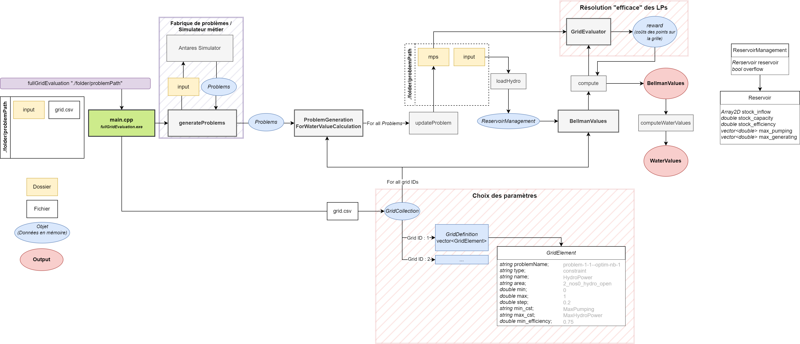

# Water Values Computation

This document explains what water values are and how to compute them for Antares studies using `water_values_exe`. It covers both the business perspective and practical usage. This document is intended for users familiar with Antares studies, hydro modeling, and stochastic optimization.

---

## Business Overview: Understanding Water Values

Water values represent the **economic value of one additional unit of water** stored in a hydro reservoir. In practice, they indicate whether it is more profitable to generate electricity immediately or to conserve water for future periods.  

In Antares, water values act as a link between consecutive time periods, guiding hydro dispatch decisions and ensuring realistic seasonal operation. They are typically computed externally and then provided as input to Antares studies.  

Expressed in €/MWh, water values primarily depend on the reservoir storage level and the time of year. High water values signal that conserving water is economically advantageous, while low water values indicate that water can be used immediately with minimal opportunity cost.  

### From economic concept to numerical computation

The executable `water_values_exe` calculates water values for a set of hydro reservoirs in a given Antares study.  

The computation relies on an efficient implementation for solving repeated optimization sub-problems. For a given reservoir, the process follows these steps:

1. **Generate sub-problems** for all Monte Carlo years using Antares. Each sub-problem represents the system for a single week and a single scenario.  
2. **Modify the sub-problems** to deactivate tracking of the reservoir's storage level, so that water usage can be freely adjusted within operational limits.  
3. **Evaluate the control grid** defined in `grid.csv`. For each sub-problem, the `HydroPower` constraint is varied from a minimum value (maximum pumping) to a maximum value (maximum generation) using the discretization step defined in the grid.  
   - Each "control" corresponds to the net water usage over the week: total generation minus total pumping multiplied by pumping efficiency, ignoring natural inflows.  
   - This step leverages a hot start to solve the same sub-problem multiple times efficiently, reducing computational time.
4. **Compute Bellman values using dynamic programming.**
   - Storage is discretized into a finite number of levels given by `nb_levels`.
   - For each week and each storage level, the algorithm evaluates all possible controls by combining the **immediate cost** for that week and scenario (from step 3) with the **expected future cost** from subsequent weeks.  
   - The Bellman value for a given storage level and a given week is computed as the **average over all Monte Carlo scenarios of the minimum total cost** achievable, considering both current and future costs.  
   - By progressing **backward week by week**, the algorithm captures the fundamental **trade-off between using water now and saving it for later**, which is at the heart of water value calculation.
5. **Derive water values** by differentiating the Bellman value with respect to storage. The result gives the marginal economic value of water in the reservoir for each week and storage level, which is then exported in a format compatible with Antares.  

To compute water values for multiple reservoirs, the calculation is done **sequentially, reservoir by reservoir**, while keeping the operation of all other reservoirs fixed. At the start, the other reservoirs follow a simple default trajectory: for each week and scenario, the control is set equal to the natural inflows.  

After the Bellman values for a reservoir are computed, an **optimal trajectory** for that reservoir can be determined for each scenario by performing a forward pass, which computes the optimal controls week by week.

Note that steps 1 and 2 are performed only once and reused for all reservoirs.

## How to use `water_values_exe`

`water_values_exe` is a command-line program that requires the following inputs:

- an **Antares study**
- a grid defined by a **grid.csv** file located at `<study_root>/user/water_values/grid.csv`
- two secondary input files **settings.yaml** and **dynamic_programming.yaml** holding various user-set parameters related to technical settings and simulation settings respectively. These files are optional, and expected at `<study_root>/user/water_values/`

## Input file grid.csv

### Format

Here is an example of a grid.csv file in its simplest form (must be comma separated, shown here as a table for readability):

|grid_id|problem_name|type|name|area|min|max|step|
|-|-|-|-|-|-|-|-|
|0|all|constraint|HydroPower|area|0|1|0.1|

with the following columns:

- `grid_id`: the ID of the grid
- `problem_name`: the name of the problem (`all` if all the problems are considered)
- `type`: the type of the constraint (`constraint` or `variable`)
- `name`: the name of the constraint or variable (`HydroPower` for Bellman values computation)
- `area`: the area to take into account
- `min`: the minimum value of the constraint or variable (from 0 to 1)
- `max`: the maximum value of the constraint or variable (from 0 to 1)
- `step`: the step of the discretization of the constraint or variable (from 0 to 1)

### Use cases where water values can be computed

Water values can be computed in the case of a single area containing one reservoir, as described above.

Water values can also be computed for multiple areas/reservoirs, which need to be represented by a distinct grid_id:

|grid_id|problem_name|type|name|area|min|max|step|
|-|-|-|-|-|-|-|-|
|0|all|constraint|HydroPower|area1|0|1|0.1|
|1|all|constraint|HydroPower|area2|0|1|0.1|
|2|all|constraint|HydroPower|area3|0|1|0.1|

In this case, water values will be **computed sequentially**, in the order in which areas are defined in grid.csv.

By default, optimal trajectories are not computed, and default trajectories are used instead, in the form of natural inflows. It is possible to compute optimal trajectories along with water values, and to take the optimal trajectory of a reservoir into account when calculating  water values of subsequent areas, with use of the `use_optimal_trajectory` value from `settings.yaml` (see below). In this case, given that water values are computed for all areas sequentially, in the order they are defined in grid.csv, water values for any given area will be computed by **using optimal trajectories of all previous areas**.

It is not currently possible to compute water values for multiple areas sharing the same grid_id, in a use case referred to as _multivariate_.

### Secondary input file: dynamic_programming.yaml

Here is an example of a **dynamic_programming.yaml** file, that defines parameters related to general simulation parameters, dynamic programming, Bellman values and penalties when computing water values:

```yaml
# All parameters related to dynamic programming and penalties when computing water values.
# Use ~ to fall back on default values (as implemented in C++ code)
# default values are subject to change

start_week : 1
# starting week of the Bellman values computation
# default: 1

end_week : 10
# end week of the Bellman values computation
# default: 52

nb_levels : 51
# number of levels of the stock
# default: 10

antares_format : false
# if true, the output will be in the Antares format (values will be interpolated to get 101 levels of stock)
# default: false

use_optimal_trajectory : false
# By default, the program will use default trajectories for the reservoirs, consisting of only natural inflows.
# If changed to `true`, optimal trajectories will be computed based on calculated Bellman values for any given area,
# and will be used when computing water values of all subsequent areas, in the order they are defined in grid.csv.
# default: false

penalty_bottom_rule_curve : 2000
# default: 0

penalty_upper_rule_curve : 2000
# default: 0

penalty_final_level : 2000
# default: 0

force_final_level : true
# default: false

final_level : ~
# default: initial level

cvar : 0.8
# default: 1.0 (all scenarios taken into account for Bellman values)
# will be restricted to [0.0 ; 1.0]
```

This file is expected to be located at `<study_root>/user/water_values/dynamic_programming.yaml`. It is optional, however default values are hard-coded in the program.

### Secondary input file: settings.yaml

Here is an example of a **settings.yaml** file, that defines parameters related to general, technical settings when computing water values:

```yaml
# All parameters related to general settings when computing water values.
# Use ~ to fall back on default values (as implemented in C++ code)
# default values are subject to change

solver : xpress
# default: xpress
# possible values are: xpress, coin

keep_mps : false
# if true, a file (.mps or .svf, see below) for each solved problem will be written to disk (location is `<study>/output/<run>/mps_n`)
# default: false

problem_format : MPS
# Selects the storage format of the generated mathematical problems (master + subproblems):
# - OPTIMIZED (default) : use underlying solver to write problems in an optimized format to reduce disk space usage and I/O time. The underlying format depends on the solver used.
#   - XPRESS : svf format: compressed binary format.
#   - COIN : unsupported. Falls back to MPS.
# - MPS : write the problems in MPS format, which is a standard format for mathematical programming problems.
# default: OPTIMIZED
# possible values are: MPS, OPTIMIZED

verbosity : INFO
# Sets the desired level of verbosity of log messages displayed in the console. 
# Setting the verbosity to a given level will allow messages to appear if their level is higher in the list or equal to the level specified.
# For example setting the verbosity to `WARNING` will filter out all messages at the `TRACE`, `DEBUG` or `INFO` level,
# and will pass along all messages at the `WARNING`, `ERR` or `FATAL` level.
# default: INFO
# possible values are: NONE, TRACE, DEBUG, INFO, WARNING, ERR, FATAL
```

This file is expected to be located at `<study_root>/user/water_values/settings.yaml`. It is optional, however default values are hard-coded in the program.

## Outputs

The outputs are the **Bellman values**, **water values**, and **optimal trajectories** (if requested by setting `use_optimal_trajectory` to true in `dynamic_programming.yaml`, see above) for all specified weeks (see parameters `start_week` and `end_week` above) discretized over the specified number of levels of stock (see parameters `nb_levels` above) for all areas in `grid.csv`.

Outputted files consist of:

- a comma-separated values file named `[grid_id]_[area]_bellman_values.csv`;
- a comma-separated values file named `[grid_id]_[area]_water_values.csv`;
- if requested, a comma-separated values file named `[grid_id]_[area]_optimal_trajectory.csv`.

These files will be created in a timecoded folder located at `<study_root>/output/<YYYYMMDD-hhmm>eco/`. This folder will hold all output files produced by the program, including problem files in the MPS or SVF format if requested (see parameters `keep_mps` and `problem_format` in `settings.yaml` above).

## Command line usage

### Quick start

1. Open a command line prompt in your Antares-Xpansion install directory (by default it is named `antaresXpansion-x.y.z-<platform>` where `x.y.z` is the version number).
    On Windows, you can launch a command line prompt by typing `cmd` in the path.

2. Run `water_values_exe<.exe>` and specify the path to the Antares study with the `--study` parameter:

    ```cmd
    water_values_exe --study data_test/one_node_base
    ```

### Command line parameters

Other command line parameters can be added to the previous line.

#### `-h, --help`

Show a help message and exit.

#### `--study <path>`

Path to the Antares study.

#### `--threads <number>`

Default value: `1`.

Number of threads that will be used to solve the problems from the grid.

## Workflow


