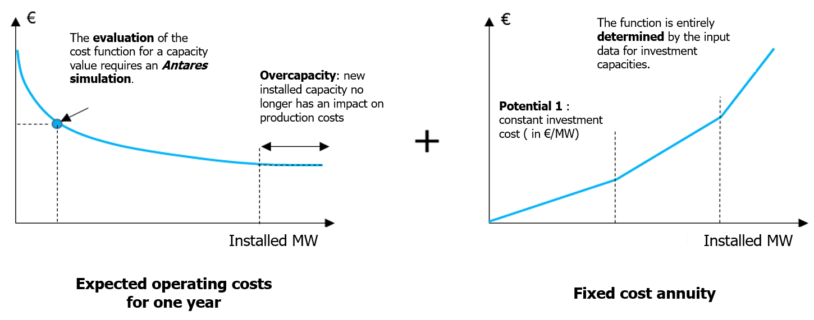
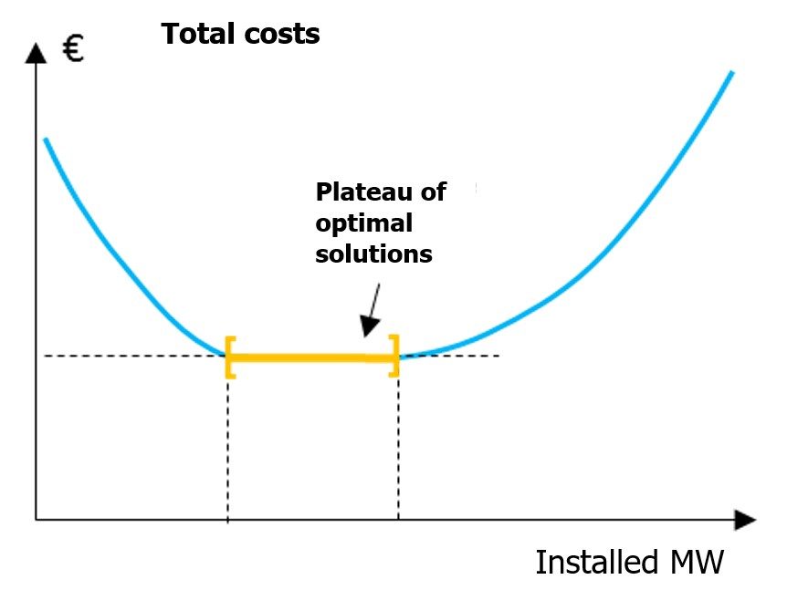

# The optimal investment problem in Antares-Xpansion
## General description

Antares-Xpansion minimizes the following cost:

$$
\min (\text{expected operating costs for one year} + \text{fixed cost annuity})
$$
over a set of investment variables specified by the user.

- The expected operating costs for one year, calculated by
Antares, includes the variable costs of thermal generation (fuel and CO2
costs), penalties in case of unsupplied energy, line transit costs (if
any), and, if the [`expansion_accurate`](../get-started/settings-definition.md#uc_type) mode is used, the start-up costs of
the thermal generation units. The production costs are calculated over
the entire geographical perimeter of the Antares study, and in
expectation over the probabilistic scenarios defined in the study. 
- The fixed-cost annuity includes the fixed operating and
maintenance costs of the generation and transit costs and, in the case
of new units, the annualized investment cost.

In the case of a problem with a single investment variable, the above
cost function can be represented by the graph in **Figure 1**.

**Figure 1** – Objective function of the Antares-Xpansion
optimization problem for one candidate.

The expected operating costs for one year decrease as installed
capacities increase. New generation or transmission capacities indeed
reduce the variable operating costs of the power system by substituting
"expensive" generation (or penalty in case of unsupplied energy) with
generation from a cheaper source. The marginal contribution of the
investment on this component of the cost function is decreasing: the
"first" installed MW have the most interesting economic potential and
a greater impact on generation costs than the "last" installed MW, which
have a lower economic utility, or even none in the case of overcapacity. Mathematically, these characteristics ensure that the expected operating cost is a convex function of the installed capacity.

In Antares-Xpansion, fixed-cost annuities are considered piecewise
linear. Different potentials are defined, each of which is characterized
by a fixed annuity in €/MW installed, and corresponds to one of the
slopes of the function, see **Figure 1**. A particular case of this
representation of fixed annuities is a fully linear function,
therefore characterized by a single fixed cost (in €/MW installed).

The final cost result - which will be called the total cost later on - is a convex function. It therefore has a minimum
solution plateau (see **Figure 2**) which in most (but not all) applications on real
data sets is reduced to a single point (see **Figure 1**). In some cases, there are several points leading to the optimal cost. Antares-Xpansion looks for an optimal solution, i.e.
the point that minimizes the total cost, or any point of the minimum
plateau in the case of a so-called degenerate problem.

**Figure** **2** – Generic case (but uncommon in practical
Antares-Xpansion cases) with a set of optimal solutions (a plateau).

## Investment variables

The investment variables are the installed capacities (in MW) of the
generation and/or transmission assets defined in the input of
Antares-Xpansion as candidates for investment.

The cases shown in **Figure 1** and **Figure 2** contain only one
investment variable. The search for the optimal solution is then carried
out over the interval \[0, available potential\], bounded on the left by
zero and on the right by the maximum available potential of the
investment under consideration. The available potential is one of the
input data of Antares-Xpansion.

In the more general case with several investment candidates,
Antares-Xpansion determines one optimal investment combination, that
is, one combination \\((c_{1},c_{2},\ldots,c_{n})\\) of the capacities of
the \\(n\\) investment candidates that minimizes the cost function.

The search for this optimal combination is done jointly (i.e. "at the same time") on
the capacities of all investment candidates, and not candidate by
candidate. By doing this, Antares-Xpansion is able to
identify and assess the impact of synergies between
structures - for example an A-B line which only becomes interesting once
the B-C line is built - or of competitions - for example an A-B-C
corridor parallel to another A-D-C corridor.

The definition of the investment variables in Antares-Xpansion is
detailed in [Define the candidates](../get-started/candidate-definition.md). For example, it may include:

- **Investable capacity values limited to a
   finite set rather than a whole interval.** This allows to consider the following cases:   
    - The investment is made in unit steps of 200 MW and we wish to constrain the search of Antares-Xpansion to the discrete set {0 MW, 200 MW, 400 MW, 600 MW…}. 
    - Adopt an all-or-nothing approach in which only two choices are possible: not to invest or to invest up to an imposed unit capacity.

    Antares-Xpansion can manage a mix of continuous investment variables, i.e. valid over the whole interval \[0, maximum potential\], and discrete variables, valid only over a finite set of values (see later).

- **Linear constraints between investable
  capacities.** Linear constraints between variables can be
  defined in investment problems. For example, they may require the
  sum of the capacities of two investment candidates to be greater or
  less than a given limit.

## Resolution with the Benders decomposition

The resolution method used by Antares-Xpansion - called Benders
decomposition - is an iterative method, which for each iteration:

- performs an Antares simulation to evaluate the expected annual
  operating costs of a combination of investments,

- determines a new investment combination by solving a _master
  problem_ in which the expected operating cost function is approximated by its
  derivatives computed at the previously tested investment combinations.
  These derivatives are also called Bender cuts.

A mathematical formulation of the optimization problem solved by Antares-Xpansion as well as details on the Benders decomposition method ar given in [Mathematical formulation of the investment problem](../optimization-principles/problem-formalization.md).
