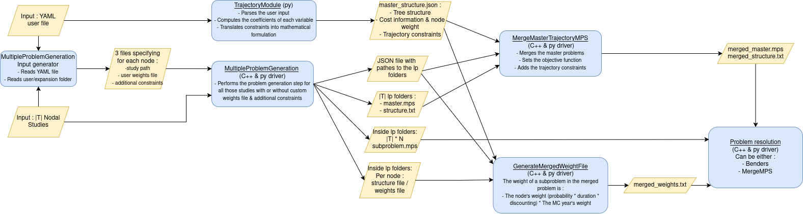

# Trajectory investment workflow



The complete workflow is composed of the following four "independent" steps : 
The first two steps are (order of execution does not matter) :

- [User input parsing & formatting](./user-input.md) : Parses and checks the user input, computes the relevant data and format it for later step.
- [Multiple problem generation](./multiple-problem-generation.md) : Runs the Xpansion problem generation for each study in the tree.

Intermediary files :

- ```master_structure.json``` : See [this section](./merge-master.md#master-structure-file) for more details.
- ```nodal_lp_info.json``` : See [this section](./multiple-problem-generation.md#output--nodal-lp-info-file) for more details.

The other two steps have to be executed after the first two :

- [Merging the generated master problems](./merge-master.md) : Generates the final merged master problem for this tree.
- [Generating the final weights file](./merge-weights.md) : Generates a weights file to take into account the properties of each node and its subproblems.

## File structure

The expected file structure at the ```INPUT_ROOT``` looks like :

```
.
├── master_structure.json
├── merge_master_options.json
├── nodal_lp_info.json
├── node_2030_study
│   ├── Desktop.ini
│   ├── input ...
│   ├── layers ...
│   ├── logs ...
│   ├── output ...
│   ├── settings ...
│   ├── study.antares
│   └── user
│       └── expansion
│           ├── candidates.ini
│           ├── candidates - with grid.ini
│           ├── capa ...
│           ├── constraints ...
│           ├── outer_loop ...
│           ├── sensitivity ...
│           ├── settings.ini
│           └── weights
│               └── weights.txt
├── node_2040_study
│   ├── Desktop.ini
│   ├── input ...
│   ├── layers ...
│   ├── logs ...
│   ├── output ...
│   ├── settings ...
│   ├── study.antares
│   └── user
│       └── expansion
│           ├── candidates.ini
│           ├── candidates - with grid.ini
│           ├── capa ...
│           ├── constraints ...
│           ├── outer_loop ...
│           ├── sensitivity ...
│           ├── settings.ini
│           └── weights
│               └── weights.txt
├── node_2050_A_study
│   ├── Desktop.ini
│   ├── input ...
│   ├── layers ...
│   ├── logs ...
│   ├── output ...
│   ├── settings ...
│   ├── study.antares
│   └── user
│       └── expansion
│           ├── candidates.ini
│           ├── candidates - with grid.ini
│           ├── capa ...
│           ├── constraints ...
│           ├── outer_loop ...
│           ├── sensitivity ...
│           ├── settings.ini
│           └── weights
│               └── weights.txt
└── node_2050_B_study
    ├── Desktop.ini
    ├── input ...
    ├── layers ...
    ├── logs ...
    ├── output ...
    ├── settings ...
    ├── study.antares
    └── user
        └── expansion
            ├── candidates.ini
            ├── candidates - with grid.ini
            ├── capa ...
            ├── constraints ...
            ├── outer_loop ...
            ├── sensitivity ...
            ├── settings.ini
            └── weights
                └── weights.txt
```